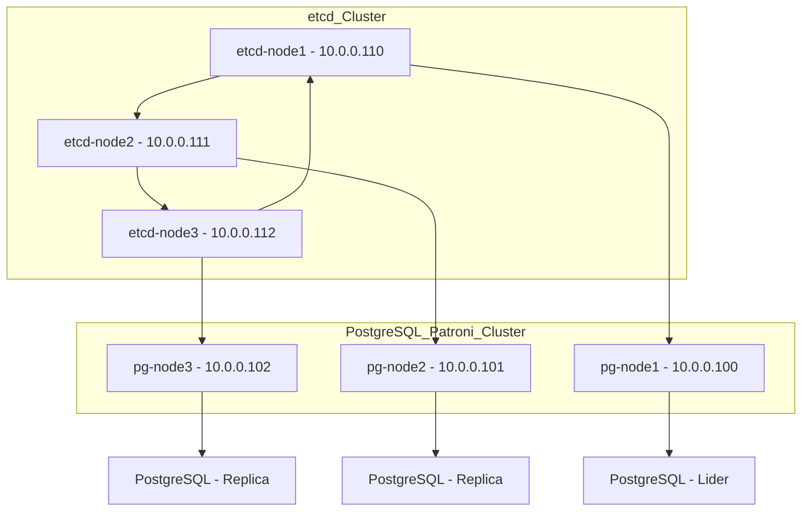

## 🧠 3. ¿Qué es Patroni?

**Patroni** es una herramienta de **orquestación de alta disponibilidad** para PostgreSQL. Utiliza un sistema de consenso distribuido (como **Etcd**, **Consul** o **ZooKeeper**) para coordinar qué nodo debe ser el **líder (primary)** y cuáles deben ser los **replicas (standby)**.


## ✅ 4. Ventajas de usar Patroni

| Ventaja                            | Descripción                                                                     |
| ---------------------------------- | ------------------------------------------------------------------------------- |
| 🔄 **Failover automático**         | Detecta caídas del nodo primario y promueve un standby sin intervención humana. |
| 🧩 **Integración con etcd/consul** | Usa sistemas de consenso para evitar split-brain y asegurar consistencia.       |
| 🛠️ **Configuración flexible**     | Compatible con múltiples entornos: bare metal, contenedores, Kubernetes.        |
| 📡 **API REST**                    | Expone endpoints para monitoreo y control externo.                              |
| 🔐 **Seguridad y control**         | Puede integrarse con sistemas de autenticación y cifrado.                       |


 
***
 

## 📅 7. Cuándo usar Patroni

*   Cuando necesitas **alta disponibilidad automática** sin intervención humana.
*   Cuando tu entorno requiere **replicación síncrona o asíncrona**.
*   Cuando trabajas en **Kubernetes** y necesitas una solución HA nativa.
*   Cuando tienes múltiples nodos PostgreSQL y quieres evitar el split-brain.


--- 

***


## ⚠️ Consideraciones clave antes de instalar

### 🔹 1. Separación de roles

*   No mezcles etcd con PostgreSQL en producción.
*   Patroni debe tener acceso exclusivo al PostgreSQL local.

### 🔹 2. Recursos dedicados

*   etcd requiere poca CPU/RAM, pero necesita estabilidad.
*   PostgreSQL debe tener prioridad en disco y memoria.

### 🔹 3. Red y puertos

*   Asegúrate de que todos los nodos puedan comunicarse entre sí.
*   Usa IPs fijas o DNS internos.

### 🔹 4. Seguridad

*   Usa TLS en etcd y Patroni si estás en producción.
*   Configura firewalls internos para limitar acceso.

--- 

## 🧩 ¿Qué puede estar junto en el mismo servidor?

| Combinación           | ¿Es recomendable?                      | Justificación                                                                                   |
| --------------------- | -------------------------------------- | ----------------------------------------------------------------------------------------------- |
| Patroni + PostgreSQL  | ✅ Sí                                   | Patroni necesita acceso directo al PostgreSQL local para controlarlo.                           |
| Patroni + etcd        | ⚠️ Solo en entornos pequeños o pruebas | En producción, etcd debe estar separado para evitar que un fallo en Patroni afecte el consenso. |
| etcd + etcd (clúster) | ✅ Sí                                   | etcd debe estar en al menos 3 nodos distintos para lograr consenso.                             |
| PostgreSQL + etcd     | ❌ No recomendado                       | Si el nodo cae, se pierde tanto la base de datos como el consenso.                              |
| Patroni + HAProxy     | ✅ Sí                                   | Patroni puede convivir con balanceadores si el servidor tiene recursos suficientes.             |

***

## 🧠 Cuándo escalar

*   **Escala Patroni + PostgreSQL** cuando necesites más réplicas para lectura.
*   **Escala etcd** si tienes más de 5 nodos Patroni (para mantener rendimiento).
*   **Escala HAProxy** si tienes muchos clientes concurrentes.


## ✅ Reglas recomendadas de infraestructura

### 1. 🔢 **Cantidad mínima de nodos**

*   **PostgreSQL + Patroni**: mínimo **2 nodos** (1 maestro + 1 réplica).
*   **etcd**: mínimo **3 nodos** para lograr consenso real y tolerancia a fallos.

> ⚠️ Con solo 1 nodo etcd, no hay consenso distribuido. Se pierde la alta disponibilidad real.

***

### 2. 🌐 **Red y conectividad**

*   Los nodos pueden solicitar tener **conectividad directa entre sí** (puertos abiertos).
*   Puertos clave:
    *   `5432`: PostgreSQL
    *   `2379`: etcd client
    *   `2380`: etcd peer
    *   `8008`: Patroni REST API

> 🔒 Se recomienda usar **firewalls internos** y **VPN** si los nodos están en diferentes redes.


¡Excelente! Vamos a construir el **manual paso a paso con laboratorio completo** para implementar un clúster de **alta disponibilidad en PostgreSQL** usando **Patroni + etcd**, sin balanceadores, con tres nodos PostgreSQL y tres nodos etcd que se comunican entre sí como un clúster distribuido.

***

## 🧭 Manual Técnico: Laboratorio de Alta Disponibilidad en PostgreSQL con Patroni y etcd (sin balanceadores)

***

### 1. 📑 Índice

1.  Objetivo
2.  Requisitos
6.  Simulación de Empresa
7.  Estructura Semántica
8.  Visualización de Arquitectura
9.  Procedimientos Técnicos
    *   Asignación de IPs y hostnames
    *   Instalación de etcd en clúster
    *   Instalación de Patroni en PostgreSQL
    *   Configuración de replicación
    *   Validación de HA
10. Consideraciones Finales
11. Buenas Prácticas
12. Recomendaciones
13. Bibliografía

***

### 2. 🎯 Objetivo

Implementar un laboratorio funcional de alta disponibilidad para PostgreSQL utilizando **Patroni** como orquestador y **etcd** como almacén distribuido de estado, sin balanceadores como HAProxy o Pgpool-II. El sistema debe permitir failover automático entre nodos PostgreSQL y mantener la integridad de los datos. Migrando  a **Patroni** sin perder la base de datos productiva, y que Patroni tome el control del clúster para gestionar la alta disponibilidad.

***

### 3. ⚙️ Requisitos

*   6 servidores Ubuntu 22.04 LTS (mínimo 2 vCPU, 2 GB RAM)
*   Acceso root o sudo
*   Conectividad entre nodos (puertos: 5432, 8008, 2379, 2380)
*   PostgreSQL 14 o superior
*   Patroni
*   etcd
*   Python3 y pip

*** 

### 6. 🏢 Simulación de Empresa

**Empresa ficticia:** *DataSecureMX*\
**Problema:** El servidor PostgreSQL principal falla y deja a la aplicación sin acceso a datos.\
**Solución:** Implementar Patroni + etcd en 3 nodos PostgreSQL y 3 nodos etcd para garantizar alta disponibilidad sin balanceadores.

***

### 7. 🧠 Estructura Semántica

```plaintext
├── PostgreSQL Nodes
│   ├── node1 (Maestro)
│   ├── node2 (Replica)
│   └── node3 (Replica)
├── etcd Cluster
│   ├── etcd1
│   ├── etcd2
│   └── etcd3
```

***

### 8. 📊 Visualización de Arquitectura



***

### 9. 🛠️ Procedimientos Técnicos

#### 🔹 Asignación de IPs y Hostnames

| Nodo  | IP         | Hostname   |
| ----- | ---------- | ---------- |
| node1 | 10.0.0.100 | pg-node1   |
| node2 | 10.0.0.101 | pg-node2   |
| node3 | 10.0.0.102 | pg-node3   |
| etcd1 | 10.0.0.110 | etcd-node1 |
| etcd2 | 10.0.0.111 | etcd-node2 |
| etcd3 | 10.0.0.112 | etcd-node3 |

```bash
sudo hostnamectl set-hostname pg-node1
sudo hostnamectl set-hostname etcd-node1
# Repetir en cada nodo con su hostname correspondiente
```

***

#### 🔹 Instalación de etcd en clúster (en etcd1, etcd2, etcd3)

```bash
sudo apt update
sudo apt install -y etcd
```

##### Configuración `/etc/default/etcd` en cada nodo:

**etcd-node1**

```bash
ETCD_NAME="etcd-node1"
ETCD_INITIAL_CLUSTER="etcd-node1=http://10.0.0.110:2380,etcd-node2=http://10.0.0.111:2380,etcd-node3=http://10.0.0.112:2380"
ETCD_INITIAL_CLUSTER_STATE="new"
ETCD_INITIAL_ADVERTISE_PEER_URLS="http://10.0.0.110:2380"
ETCD_ADVERTISE_CLIENT_URLS="http://10.0.0.110:2379"
ETCD_LISTEN_PEER_URLS="http://10.0.0.110:2380"
ETCD_LISTEN_CLIENT_URLS="http://10.0.0.110:2379"
```

**Repetir en etcd-node2 y etcd-node3 cambiando IP y nombre**

```bash
sudo systemctl restart etcd
sudo systemctl status etcd
```

***

#### 🔹 Instalación de Patroni y PostgreSQL (en node1, node2, node3)

 
### 🔒 1. **Respaldar la base de datos maestra**
Aunque no se espera pérdida de datos, **haz un respaldo completo** por seguridad:
```bash
pg_dumpall > respaldo.sql
```

### 🛑 2. **Detener PostgreSQL en los tres nodos**
Patroni necesita iniciar PostgreSQL por sí mismo:
```bash
sudo systemctl stop postgresql
```


```bash
sudo apt update
sudo apt upgrade -y

#sudo apt install -y postgresql postgresql-contrib
sudo apt -y install python3 python3-pip python3-yaml  
sudo apt install python3-testresources
sudo pip3 install --upgrade setuptools
sudo pip3 install psycopg2 patroni python-etcd
sudo systemctl stop postgresql

sudo rm -rf /var/lib/postgresql/14/main
sudo mkdir -p /var/lib/postgresql/data

sudo chown postgres:postgres /var/lib/postgresql/data
```

***

### 🔧 C. Configuración de PostgreSQL

Asegúrate de que `postgresql.conf` tenga:

```conf
listen_addresses = '*'
wal_level = replica
max_wal_senders = 10
hot_standby = on
```


Y en `pg_hba.conf`:

```conf
host replication replicator 10.0.0.0/24 md5
```

Crear usuario replicador:

```bash
psql -U postgres
CREATE USER replicator REPLICATION LOGIN ENCRYPTED PASSWORD 'replicatorpass';
```


#### 🔹 Configuración de Patroni

**Archivo `/etc/patroni.yml` en node1 (maestro)**

```yaml
# Nombre del clúster y nodo
scope: pg_cluster              # Identificador del clúster Patroni
namespace: /service/           # Prefijo en etcd para almacenar la configuración
name: pg-node1                 # Nombre del nodo actual

# Configuración de la API REST de Patroni
restapi:
  listen: 10.0.0.100:8008      # Dirección IP y puerto donde escucha la API REST
  connect_address: 10.0.0.100:8008  # Dirección IP y puerto para que otros nodos se conecten

# Configuración de etcd (coordinador de alta disponibilidad)
etcd:
  host: 10.0.0.110:2379,10.0.0.111:2379,10.0.0.112:2379  # IPs de los nodos etcd

# Configuración de arranque del clúster
bootstrap:
  dcs:
    ttl: 30                        # Tiempo de vida de la sesión en etcd
    loop_wait: 10                 # Intervalo entre ciclos de verificación
    retry_timeout: 10            # Tiempo de espera para reintentar operaciones
    maximum_lag_on_failover: 10485760  # Máximo lag permitido para hacer failover
    master_start_timeout: 300    # Tiempo máximo para que el nodo maestro arranque
    postgresql:
      use_pg_rewind: true        # Permite usar pg_rewind para sincronizar nodos
      use_slots: true            # Habilita replication slots

  # Inicialización de la base de datos (descomentarlo si se desea inicializar)
  #initdb:
  #  - encoding: UTF8
  #  - locale: en_US.UTF-8

  #initdb: [] # En caso de no ocupar inicializar usar este 

  # Configuración de acceso (pg_hba.conf)
  pg_hba:
    - host replication replicator 10.0.0.100/32 trust  # Permite replicación desde nodo 1
    - host replication replicator 10.0.0.101/32 trust  # Permite replicación desde nodo 2
    - host replication replicator 10.0.0.102/32 trust  # Permite replicación desde nodo 3
    - host all all 0.0.0.0/0 md5                       # Permite acceso general con contraseña

  # Usuarios iniciales
  users:
    admin:
      password: admin@123
      options:
        - superuser
    replicator:
      password: rep-pass
      options:
        - replication

  # Configuración de clonación (para nodos esclavos)
  clone:
    method: basebackup         # Método de clonación
    host: IP_DEL_MAESTRO       # IP del nodo maestro
    user: replicator           # Usuario de replicación
    password: rep-pass         # Contraseña del usuario de replicación

# Configuración de PostgreSQL
postgresql:
  listen: 10.0.0.100:5432         # IP y puerto donde escucha PostgreSQL
  connect_address: 10.0.0.100:5432  # IP y puerto para que otros nodos se conecten
  data_dir: /var/lib/postgresql/data  # Directorio de datos de PostgreSQL
  bin_dir: /usr/lib/postgresql/14/bin # Ruta de los binarios de PostgreSQL

  # Autenticación
  authentication:
    replication:
      username: replicator
      password: admin@123
    superuser:
      username: postgres
      password: admin@123

  # Parámetros de configuración de PostgreSQL
  parameters:
    wal_level: replica             # Nivel de WAL para replicación
    hot_standby: 'on'              # Permite consultas en nodos esclavos
    max_wal_senders: 10            # Máximo número de procesos de envío de WAL
    max_replication_slots: 10      # Máximo número de replication slots
    archive_mode: 'off'            # Desactiva archivado de WAL
    restore_command: 'false'       # Comando de restauración (no usado aquí)

# Etiquetas del nodo (usadas por Patroni para decisiones de failover y balanceo)
tags:
  nofailover: false               # Permite que este nodo participe en failover
  noloadbalance: false            # Permite que este nodo reciba tráfico
  clonefrom: false                # Indica si este nodo debe clonarse desde otro
```

**En node2 y node3**: mismo archivo pero sin sección `bootstrap`, y con IPs correspondientes.

***

#### 🔹 Servicio Systemd para Patroni

```ini
[Unit]
Description=Patroni PostgreSQL HA
After=network.target etcd.service

[Service]
Type=simple
User=postgres
Group=postgres
ExecStart=/usr/bin/python3 -m patroni -c /etc/patroni.yml
Restart=on-failure

[Install]
WantedBy=multi-user.target
```

```bash
sudo systemctl daemon-reload
sudo systemctl enable patroni
sudo systemctl start patroni

-- Tambien puede iniciarlo asi 
patroni patroni.yml
```

Simular salida:

    INFO: running Patroni
    INFO: initializing a new cluster
    INFO: promoted master
    INFO: watching etcd for changes


***

#### 🔹 Validación del clúster

```bash
patronictl -c /etc/patroni.yml list
```

**Simulación de salida:**

```plaintext
+ Cluster: pg_cluster (3 nodes) -----------+
| Node     | Role    | State   | TL | Lag  |
|----------|---------|---------|----|------|
| pg-node1 | Leader  | running | 1  | 0    |
| pg-node2 | Replica | running | 1  | 32kB |
| pg-node3 | Replica | running | 1  | 28kB |
```

***


### 🔧 F. Verificación y failover

Simula apagado del nodo principal:

```bash
sudo systemctl stop patroni
```

En segundos, otro nodo será promovido:

    INFO: node secundary1 promoted to master

***

 


### 🔍 7. **Verificar el estado del clúster**
Puedes usar:
```bash
curl http://localhost:8008
```
 
 

## 🧪 Validaciones importantes

- Verifica que el nodo maestro esté registrado como **líder**.
- Verifica que los esclavos estén sincronizados.
- Verifica que la replicación esté funcionando.
- Verifica que los datos productivos estén intactos.
 

### 🔚 Consideraciones Finales

*   Asegúrate de que los nodos etcd estén sincronizados
*   Patroni no requiere balanceadores si las aplicaciones conocen el nodo líder
*   Puedes usar DNS dinámico o scripts para redirigir tráfico si el líder cambia

***

### ✅ Buenas Prácticas y Recomendaciones

*   Usar claves SSH entre nodos
*   Configura backups automáticos
*   Configurar firewall para limitar acceso a puertos
*   Monitorear logs de Patroni y etcd
*   Realizar pruebas de failover periódicas
*   Añadir TLS a etcd y Patroni
*   Usar `consul` como alternativa a etcd si ya lo tienes en tu infraestructura
*   Integrar con `pgbouncer` si necesitas pooling

 
 
***


 

## 🧠 Explicación clara de cada componente

### 🔹 Patroni (en cada nodo)

*   Monitorea su propia instancia de PostgreSQL.
*   Expone una **API REST** para saber si está activo, si es líder, etc.
*   Intenta adquirir el **lock de liderazgo** en etcd.
*   Si lo consigue, **inicia PostgreSQL como maestro**.
*   Si no lo consigue, **inicia como réplica**.

### 🔹 etcd (centralizado o distribuido)

*   No tiene PostgreSQL ni Patroni.
*   Solo guarda claves y valores como:
    *   ¿Quién es el líder actual?
    *   ¿Qué nodos están vivos?
*   Usa el algoritmo **Raft** para decidir quién tiene el lock.
*   Evita que dos nodos sean líderes al mismo tiempo (*split-brain*).
 

## 🧩 Comparación de roles

| Componente  | Función principal                                                   |
| ----------- | ------------------------------------------------------------------- |
| **Patroni** | Orquestador HA, monitorea PostgreSQL, expone API REST, decide líder |
| **etcd**    | Sistema de consenso, almacena estado del clúster, evita conflictos  |


## 🧠 ¿Quién expone la API REST?

👉 **La API REST la expone Patroni**, no etcd.

Cada nodo donde corre Patroni tiene su propia API REST (por defecto en el puerto `8008`), que permite:

*   Consultar el estado del nodo (`/health`, `/status`)
*   Forzar un failover manual
*   Ver si el nodo es líder o réplica

```bash
curl http://localhost:8008/health
```

**Respuesta esperada**:

```json
{"state": "running", "role": "master", "server_version": 120005}
```

***

## 🩺 ¿Quién valida la salud de cada nodo?

👉 **Patroni valida la salud de los nodos PostgreSQL**.

Cada instancia de Patroni:

*   Monitorea su propio PostgreSQL local.
*   Verifica si está activo, si responde, si tiene acceso al disco, etc.
*   Reporta su estado a etcd mediante actualizaciones periódicas.

Patroni no monitorea directamente a otros nodos, pero **usa etcd para saber qué reportan los demás**.

***

## 👑 ¿Quién decide qué nodo será el maestro?

👉 **La decisión la toma Patroni**, pero **usa etcd como árbitro**.

### ¿Cómo funciona?

1.  Cada nodo Patroni intenta **adquirir un "lock" de liderazgo** en etcd.
2.  etcd permite que **solo uno lo tenga a la vez** (consenso).
3.  El nodo que obtiene el lock se convierte en **líder (master)**.
4.  Si el líder falla, otro nodo intenta adquirir el lock.
5.  Patroni promueve ese nodo a líder automáticamente.

***


## 🧠 ¿Qué función tiene Patroni?

**Patroni** es el **orquestador de alta disponibilidad** para PostgreSQL. Su función principal es:

### 🔹 *Gestionar el estado del clúster PostgreSQL*:

*   Decide qué nodo debe ser el **líder (primary)**.
*   Promueve automáticamente un **replica (standby)** a líder si el actual falla.
*   Supervisa la salud de los nodos PostgreSQL.
*   Expone una **API REST** para monitoreo y control externo.

### 🔹 *Automatiza tareas críticas*:

*   **Failover automático** sin intervención humana.
*   **Inicialización del clúster**.
*   **Replicación entre nodos**.
*   **Configuración dinámica** de parámetros PostgreSQL.

***

## 🧠 ¿Qué función tiene etcd?

**etcd** es un **almacenamiento clave-valor distribuido** que actúa como el **sistema de consenso** para Patroni.

### 🔹 *Coordina decisiones entre nodos*:

*   Patroni usa etcd para **registrar el estado del clúster**.
*   etcd asegura que **solo un nodo sea líder** en un momento dado (evita *split-brain*).
*   Sirve como **fuente de verdad compartida** entre todos los nodos Patroni.

### 🔹 *Alta disponibilidad del consenso*:

*   etcd está diseñado para ser **tolerante a fallos**.
*   Usa el algoritmo **Raft** para lograr consenso entre múltiples instancias.

***
*   **Patroni** consulta a **etcd** para saber si puede ser líder.
*   **etcd** mantiene el estado del clúster y permite que Patroni tome decisiones coordinadas.

---


❓1. ¿Los nodos etcd se comunican entre sí en una topología con múltiples instancias?

Sí. Cuando hay varios nodos etcd, forman un clúster de consenso basado en el algoritmo Raft. Esto significa que:

- Se sincronizan constantemente entre ellos.
- Uno actúa como líder, los demás como seguidores.
- El líder recibe las escrituras y las replica a los demás para mantener la consistencia.

---

❓2. ¿A qué nodo etcd se conecta Patroni cuando hay más de uno?

Patroni se conecta a todos los nodos etcd definidos en su configuración. No depende de un nodo específico. En su archivo patroni.yml, se especifica una lista como:

`yaml
etcd:
  hosts: etcd1:2379,etcd2:2379,etcd3:2379
`

Patroni interactúa con el clúster etcd como un todo, y las operaciones se gestionan por el nodo líder de etcd.

---

❓3. ¿Qué ocurre si se cae uno de los nodos etcd en un clúster de tres?

- El clúster sigue funcionando normalmente mientras haya quorum, es decir, al menos 2 de 3 nodos activos.
- Si el nodo caído era el líder, los dos restantes eligen automáticamente un nuevo líder.
- Si caen 2 nodos, el clúster pierde el quorum y no puede procesar escrituras, lo que afecta a Patroni y puede detener el failover automático.


❓ ¿Por qué se recomiendan 3 nodos etcd?

- Para tener quorum (2 de 3 nodos activos).
- Para que el clúster etcd pueda elegir nuevo líder si uno falla.
- Para que Patroni pueda seguir operando incluso si un nodo etcd se cae.


❓ ¿Cuándo funciona etcd?

| Cantidad de nodos etcd | ¿Funciona? | ¿Alta disponibilidad? | ¿Quorum tolerante a fallos? |
|------------------------|------------|------------------------|-----------------------------|
| 1 nodo | ✅ Sí | ❌ No | ❌ No (si se cae, todo falla) |
| 2 nodos | ✅ Sí | ❌ No | ❌ No (si se cae 1, no hay quorum) |
| 3 nodos | ✅ Sí | ✅ Sí | ✅ Sí (puede fallar 1 y seguir operando) |


❓ ¿Puede funcionar Patroni con un solo nodo etcd?

Sí, funciona. Puedes tener:
- 1 nodo etcd
- 3 nodos PostgreSQL con Patroni

En esta configuración, Patroni usa ese único etcd como almacén de estado y coordinación. Mientras ese nodo etcd esté vivo y accesible, el clúster funcionará correctamente: habrá failover, elección de líder, etc.

---
❓ ¿Cuál es el problema con tener solo un etcd?

- No hay quorum: etcd necesita al menos 2 nodos para formar consenso. Con solo uno, no hay tolerancia a fallos.
- Punto único de falla: si ese nodo etcd se cae, Patroni no puede hacer failover, ni cambiar el líder, ni actualizar el estado del clúster.
- Aunque los nodos PostgreSQL seguirán funcionando en su estado actual, el clúster queda congelado.


❓¿Por qué algunas topologías usan solo 1 nodo etcd?

- Simplicidad: Menos infraestructura, más fácil de desplegar.
- Funciona bien... mientras no falle.
- Desventaja crítica: Si ese único nodo etcd se cae, Patroni pierde la capacidad de coordinar el clúster. No hay failover, no hay cambios de líder, y el sistema queda congelado.


### 🧠 ¿Qué es el consenso y el quorum en etcd?

- **Consenso**: Es el proceso mediante el cual los nodos de etcd acuerdan el estado actual del sistema (por ejemplo, quién es el líder).
- **Quorum**: Es el número mínimo de nodos que deben estar de acuerdo para tomar decisiones. En etcd, el quorum es **mayoría simple**:  
  - En un clúster de 3 nodos, el quorum es 2.  
  - En un clúster de 5 nodos, el quorum es 3.
 
### ⚠️ ¿Qué pasa si tienes solo un nodo etcd?

- **No hay quorum**, porque no hay otros nodos con los que llegar a un acuerdo.
- El nodo único **no puede tolerar fallos**. Si se cae:
  - Patroni **no podrá hacer failover automático**.
  - No se podrán escribir ni leer estados de liderazgo.
  - La alta disponibilidad queda **inactiva** hasta que etcd se recupere.

 
### ✅ ¿Por qué puede funcionar igual?

- Mientras el nodo etcd esté **activo y saludable**, Patroni puede operar normalmente.
- Es útil para **entornos de desarrollo, pruebas o laboratorios** donde la tolerancia a fallos no es crítica.


### 🧩 Conclusión

Tu topología **funciona**, pero **no tiene consenso ni quorum**, lo que significa que **no es tolerante a fallos**. Para producción, se recomienda:

- **etcd en clúster de 3 o 5 nodos**.
- Patroni configurado para usar ese clúster.
- Opcional: monitoreo con herramientas como `Prometheus + Grafana`.


***

## 🔢 ¿Cuántos se recomiendan de cada uno?

| Componente           | Mínimo         | Recomendado | Justificación                              |
| -------------------- | -------------- | ----------- | ------------------------------------------ |
| PostgreSQL + Patroni | 2 nodos        | 3 nodos     | Para tener 1 maestro y al menos 2 réplicas |
| etcd                 | 1 nodo (no HA) | 3 nodos     | Para consenso real y tolerancia a fallos, pueden ser contenedores   |
| HAProxy / PgBouncer / PgPool  | 1 nodo         | 2 nodos     | Para balanceo y tolerancia a fallos        |
| Prometheus / Grafana | Opcional       | 1 nodo      | Para monitoreo del clúster                 |


---

## 📝 Notas importantes

*   etcd **no sabe nada de PostgreSQL**, solo guarda claves y valores.
*   Patroni **sí entiende PostgreSQL**, y toma decisiones basadas en su estado.
*   La API REST es útil para monitoreo, automatización y pruebas.


--- 
### ✅ 1. ¿Cómo validar que el archivo `patroni.yml` es correcto?

Puedes hacerlo de varias formas:

#### **a. Validación sintáctica del YAML**
Usa herramientas como:

- **`yamllint`** (instalable con `pip install yamllint`):
  ```bash
  yamllint /etc/patroni.yml
  ```

- **Validadores online** como https://www.yamllint.com

Esto asegura que la estructura del archivo es válida, aunque no verifica si los valores son correctos para Patroni.

#### **b. Validación funcional**
Una vez que Patroni está instalado, puedes correr:

```bash
patroni /etc/patroni.yml
```

Si hay errores, Patroni los mostrará en consola. Si todo está bien, iniciará el servicio y comenzará a gestionar el nodo.

---

### ✅ 2. ¿Dónde se generan los logs de Patroni?

Por defecto, Patroni **escribe los logs en la consola**. Para redirigirlos a un archivo, puedes:

- Usar `systemd` y configurar el servicio para que los logs se vayan a `journalctl`:
  ```bash
  journalctl -u patroni -f
  ```

- O modificar el archivo `patroni.yml` para incluir una sección de logging:

```yaml
logging:
  level: INFO
  format: '%(asctime)s %(levelname)s: %(message)s'
  logfile: /var/log/patroni.log
```

---

### ✅ 3. ¿El archivo `patroni.yml` debe ser igual en todos los nodos?

**No exactamente.** Aunque la estructura general es la misma, **cada nodo debe tener su propia configuración específica**, especialmente en estas secciones:

#### 🔁 Diferencias por nodo:

| Sección         | Nodo Maestro | Nodo Esclavo |
|----------------|--------------|--------------|
| `name:`        | `pg-node1`   | `pg-node2`, `pg-node3` |
| `listen:` / `connect_address:` | IP del nodo actual | IP del nodo actual |
| `data_dir:`    | Ruta local del nodo | Ruta local del nodo |
| `clone:`       | No se usa (en maestro) | Se usa para clonar desde el maestro |
| `pg_hba:`      | Puede ser igual | Puede ser igual |
| `authentication:` | Igual | Igual |
| `tags:`        | Puede variar (por ejemplo, `nofailover: true` si no quieres que un nodo participe en failover) |

---

### ✅ 4. ¿Cómo integrar los esclavos a Patroni si ya están replicando?

Si ya tienes replicación configurada, puedes:

1. **Detener PostgreSQL en los esclavos.**
2. **Configurar `patroni.yml` en cada esclavo**, asegurándote de:
   - Usar el mismo `scope` y `namespace`.
   - Cambiar `name`, `listen`, `connect_address`, `data_dir`.
   - Configurar correctamente la sección `clone:` si quieres que Patroni gestione la clonación.
3. **Iniciar Patroni en cada esclavo.**
4. Patroni detectará el maestro y sincronizará los esclavos automáticamente.


## Links
```conf
https://medium.com/@yaseminbsra.sergen/postgresql-with-patroni-high-availability-and-backup-integration-1fd97bffbac1
https://medium.com/@jramcloud1/set-up-high-availability-postgresql-cluster-using-patroni-1367c72fbedb
Patroni -> https://medium.com/@joaovic32/demystifying-high-availability-postgresql-with-patroni-and-pgpool-ii-on-ubuntu-428c91a55b1a
https://ozwizard.medium.com/postgresql-with-patroni-installation-and-configuration-49d6b8105580

*   <https://github.com/zalando/patroni>
*   <https://etcd.io/docs/>
*   <https://www.postgresql.org/docs/current/warm-standby.html>

```
