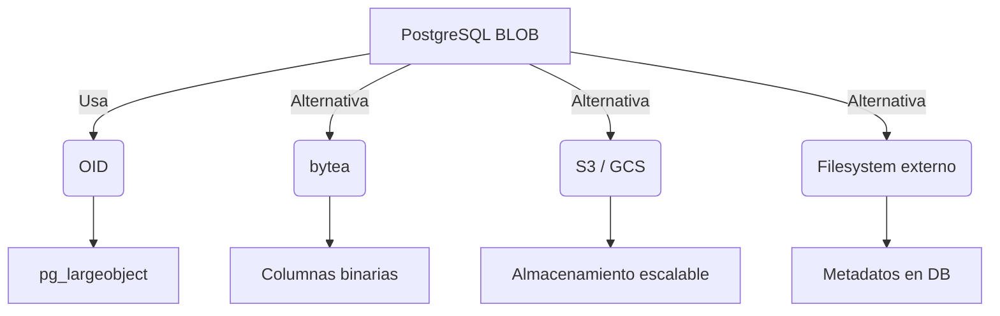

## 📦 ¿Qué es un BLOB?

En PostgreSQL, un **BLOB** es un tipo de dato que permite almacenar **objetos binarios grandes** directamente en la base de datos. Aunque PostgreSQL no tiene un tipo llamado `BLOB` como tal (como lo tiene Oracle o MySQL), **sí ofrece dos mecanismos equivalentes**:

### 1. `OID` (Object Identifier)

*   Utiliza la tabla interna `pg_largeobject`.
*   Ideal para archivos grandes (>1MB).
*   Requiere funciones como `lo_import`, `lo_export`, `lo_unlink`.

### 2. `bytea` (Binary Array)

*   Almacena directamente el contenido binario en una columna.
*   Más simple de usar.
*   Mejor para archivos pequeños (<1MB).


## ✅ Ventajas

| Ventaja                     | Descripción                                                 |
| --------------------------- | ----------------------------------------------------------- |
| **Transacciones completas** | Los archivos se almacenan junto con los datos relacionados. |
| **Seguridad centralizada**  | Control de acceso desde PostgreSQL.                         |
| **Portabilidad**            | Los backups incluyen los archivos binarios.                 |
| **Integridad referencial**  | Los archivos están ligados a registros específicos.         |


## ❌ Desventajas

| Desventaja                 | Descripción                                                       |
| -------------------------- | ----------------------------------------------------------------- |
| **Tamaño de base**         | Puede crecer rápidamente si se almacenan muchos archivos grandes. |
| **Rendimiento**            | Consultas sobre BLOBs pueden ser lentas si no se optimizan.       |
| **Complejidad**            | Requiere funciones especiales para importar/exportar.             |
| **No apto para streaming** | No está diseñado para servir archivos multimedia en tiempo real.  |


## 🧰 Casos de uso reales

*   **Sistemas legales**: Contratos escaneados.
*   **Sistemas médicos**: Imágenes de estudios clínicos.
*   **Sistemas educativos**: PDFs de tareas y certificados.
*   **Sistemas de identidad**: Fotografías de usuarios.


## 📅 Cuándo usarlo

*   Cuando se necesita **integridad transaccional** entre datos y archivos.
*   Cuando el volumen de archivos es **moderado**.
*   Cuando se busca **centralizar la seguridad**.
*   Cuando los archivos deben ser **versionados o auditados**.


## 🚫 Cuándo no usarlo

*   Cuando se manejan archivos **muy grandes** (>100MB).
*   Cuando se requiere **streaming o acceso concurrente intensivo**.
*   Cuando ya se usa almacenamiento externo (S3, GCS, etc.).
*   Cuando el equipo DBA no tiene experiencia con `pg_largeobject`.


## 🔄 Alternativas

| Alternativa           | Descripción                                 |
| --------------------- | ------------------------------------------- |
| `bytea`               | Binarios pequeños directamente en columnas. |
| S3 / GCS / Azure Blob | Almacenamiento externo escalable.           |
| Filesystem + Metadata | Guardar solo rutas en PostgreSQL.           |


## 🧠 Consideraciones antes y después

### Antes:

*   ¿Qué tamaño tendrán los archivos?
*   ¿Qué frecuencia de acceso tendrán?
*   ¿Se requiere replicación?
*   ¿El equipo tiene experiencia con objetos binarios?

### Después:

*   Monitorear crecimiento de la base.
*   Implementar limpieza (`lo_unlink`).
*   Validar backups con `pg_dump --blobs`.


## 📝 Notas importantes

*   Los BLOBs se almacenan en `pg_largeobject` si se usa `OID`.
*   `bytea` es más simple pero menos eficiente para archivos grandes.
*   Los BLOBs no se replican automáticamente en algunas configuraciones.


## 🧠 Opinión de la comunidad

*   **DBAs** prefieren almacenar archivos fuera de la base.
*   **Desarrolladores** valoran tener todo en un solo lugar.
*   **Arquitectos cloud** recomiendan almacenamiento externo.


## 📎 Ejemplos reales

*   **Gobierno de México**: Documentos oficiales en PostgreSQL con `OID`.
*   **Universidades**: Tesis y documentos académicos en `bytea`.
*   **Startups legales**: Contratos firmados digitalmente en `pg_largeobject`.


## 📊 Visualización comparativa

 


--- 

 
## 🧭 1. Índice

1.  Objetivo
2.  Requisitos
3.  Ventajas y Desventajas
4.  Casos de Uso
5.  Simulación empresarial
6.  Estructura Semántica
7.  Visualizaciones
8.  Procedimientos
    *   Instalación y preparación
    *   Creación de tabla con BLOB
    *   Inserción de archivos binarios
    *   Lectura y extracción de BLOBs
    *   Mantenimiento y limpieza
9.  Sección Final
10. Bibliografía


## 🎯 2. Objetivo

Este manual te permitirá:

*   Comprender qué es un BLOB en PostgreSQL.
*   Crear estructuras que almacenen archivos binarios (PDFs, imágenes, etc.).
*   Insertar, consultar y eliminar BLOBs desde la base de datos.
*   Simular un entorno empresarial donde se gestionan documentos adjuntos.


## ⚙️ 3. Requisitos

*   PostgreSQL 13 o superior
*   Acceso a línea de comandos (`psql`) o PgAdmin
*   Conocimientos básicos de SQL
*   Python (opcional para simulación de carga de archivos)
*   Permisos de escritura en el sistema de archivos si se usa `lo_import` / `lo_export`


## ✅ 4. Ventajas y Desventajas

| Ventajas                                                    | Desventajas                                                    |
| ----------------------------------------------------------- | -------------------------------------------------------------- |
| Permite almacenar archivos directamente en la base de datos | Puede aumentar el tamaño de la base de datos rápidamente       |
| Seguridad centralizada                                      | Menor rendimiento en consultas si no se gestiona correctamente |
| Integridad referencial                                      | Requiere configuración especial para backups                   |


## 🧰 5. Casos de Uso

*   Gestión documental (PDFs, contratos, imágenes)
*   Almacenamiento de evidencias digitales
*   Archivos adjuntos en sistemas CRM o ERP
*   Fotografías en sistemas de identificación


## 🏢 6. Simulación empresarial

**Empresa ficticia:** *LegalDocsMX*\
**Escenario:** La empresa necesita almacenar contratos escaneados en su sistema PostgreSQL para consulta legal. Cada contrato se guarda como un archivo PDF y se asocia a un cliente.


 


## 🛠️ 8. Procedimientos

### 🔹 A. Instalación y preparación

```bash
sudo apt install postgresql
sudo -u postgres psql
```

Activamos el soporte para objetos grandes (BLOBs):

```sql
CREATE EXTENSION IF NOT EXISTS "lo";
```

### 🔹 B. Creación de tabla con BLOB

```sql
CREATE TABLE cliente (
    id SERIAL PRIMARY KEY,
    nombre VARCHAR(100),
    correo VARCHAR(100)
);

CREATE TABLE contrato (
    id SERIAL PRIMARY KEY,
    cliente_id INT REFERENCES cliente(id),
    archivo_pdf OID,
    fecha_subida DATE DEFAULT CURRENT_DATE
);
```

### 🔹 C. Inserción de archivos binarios

Usamos `lo_import` para cargar un archivo PDF:

```sql

insert into cliente(nombre,correo) values ('Jose Rodriguez', 'jose@gmail.com');

-- Simulamos que el archivo está en /tmp/contrato1.pdf
INSERT INTO contrato (cliente_id, archivo_pdf)
VALUES ((select id from cliente where nombre = 'Jose Rodriguez'), lo_import('/tmp/contrato1.pdf'));

\x
select * from cliente;
select * from contrato;
señect * from pg_largeobject;

```

### 🔹 D. Lectura y extracción de BLOBs

Exportamos el archivo desde PostgreSQL:

```sql
SELECT lo_export(archivo_pdf, '/tmp/contrato1_exportado.pdf') FROM contrato WHERE cliente_id = 1;
```

### 🔹 E. Mantenimiento y limpieza

Eliminar un archivo binario:

```sql
SELECT lo_unlink(archivo_pdf) FROM contrato WHERE cliente_id = 1;
DELETE FROM contrato WHERE id = 1;

\x
select * from cliente;
select * from contrato;
select * from pg_largeobject;
```


## 📌 9. Sección Final

### 🔍 Consideraciones

*   Los BLOBs se almacenan en una tabla interna llamada `pg_largeobject`.
*   No se recomienda almacenar archivos muy grandes (>50MB) directamente en la base.

### 📝 Notas

*   El tipo `OID` es usado para referenciar objetos binarios.
*   Se requiere acceso al sistema de archivos para importar/exportar.

### 💡 Consejos

*   Usa `lo_import` solo en entornos controlados.
*   Considera almacenar solo metadatos en PostgreSQL y los archivos en S3 o similar si el volumen es alto.

### 🧼 Buenas Prácticas

*   Indexa las tablas que referencian BLOBs.
*   Realiza limpieza periódica de objetos no referenciados.

### 🔄 Otros Tipos

*   Puedes usar `bytea` en lugar de `OID` si prefieres almacenar directamente el contenido binario.

### 📊 Tabla Comparativa

| Tipo    | Tamaño Máximo | Rendimiento | Uso recomendado   |
| ------- | ------------- | ----------- | ----------------- |
| `OID`   | >1GB          | Alto        | Archivos grandes  |
| `bytea` | \~1GB         | Medio       | Archivos pequeños |


## 📚 10. Bibliografía

*   <https://www.postgresql.org/docs/current/largeobjects.html>
*   <https://wiki.postgresql.org/wiki/BinaryFilesInDB>


 
