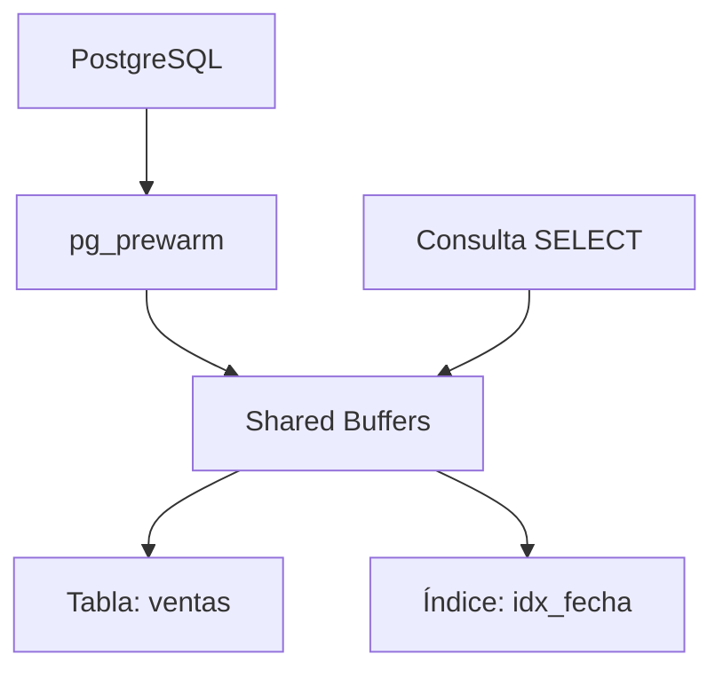

# 🧪 Manual Técnico: Acelerando el Acceso a Datos con `pg_prewarm` en PostgreSQL


## 1. 📑 Índice

1.  Objetivo
2.  Requisitos
3.  ¿Qué es `pg_prewarm`?
4.  Ventajas y Desventajas
5.  Casos de Uso
6.  Simulación de Escenario Empresarial
7.  Estructura Semántica
8.  Visualización del Flujo
9.  Laboratorio Paso a Paso
    *   Instalación de `pg_prewarm`
    *   Creación de tabla con 100,000 registros
    *   Consultas con y sin `pg_prewarm`
    *   Comparación de tiempos
10. Consideraciones Finales
11. Buenas Prácticas
12. Bibliografía


## 2. 🎯 Objetivo

Demostrar cómo la extensión `pg_prewarm` puede mejorar el rendimiento de consultas en PostgreSQL al precargar datos en el búfer compartido, evitando lecturas desde disco.


## 3. 🧰 Requisitos

*   PostgreSQL 12 o superior
*   Acceso como superusuario (`postgres`)
*   SO: Linux (preferentemente Ubuntu/Debian)
*   Extensión `pg_prewarm` instalada
*   Herramienta de monitoreo opcional: `pg_stat_statements`


## 4. ❓ ¿Qué es `pg_prewarm`?

Es una extensión que permite precargar bloques de datos en la memoria compartida de PostgreSQL (buffer cache), lo que ayuda a evitar que el rendimiento sea lento justo después de reiniciar el servidor, ya que normalmente la caché se pierde.


## 5. ⚖️ Ventajas y Desventajas

| Ventajas                               | Desventajas                                                  |
| -------------------------------------- | ------------------------------------------------------------ |
| Reduce tiempos de respuesta iniciales  | Requiere memoria RAM disponible                              |
| Útil tras reinicios o vaciado de caché | No es automático (requiere configuración o ejecución manual) |
| Fácil de usar con `pg_prewarm()`       | No sustituye un buen diseño de índices                       |


## 6. 🧩 Casos de Uso

*   Sistemas con reinicios frecuentes (por mantenimiento o fallos)
*   Consultas críticas que deben responder rápido desde el arranque
*   Dashboards o reportes que acceden a grandes volúmenes de datos


## 7. 🏢 Simulación Empresarial

**Empresa:** AgroData S.A.\
**Problema:** Tras reinicios del servidor, los reportes de ventas tardan mucho en cargar.\
**Solución:** Usar `pg_prewarm` para precargar la tabla `ventas` y su índice principal.


## 8. 🧠 Estructura Semántica

```mermaid
graph TD
    A[PostgreSQL] --> B[pg_prewarm]
    B --> C[Shared Buffers]
    C --> D[Tabla: ventas]
    C --> E[Índice: idx_fecha]
    F[Consulta SELECT] --> C 
```


## 9. 🧪 Laboratorio Paso a Paso

### 🔹 9.1 Instalación de `pg_prewarm`

```bash
-- Como superusuario
CREATE EXTENSION IF NOT EXISTS pg_prewarm;
```

📌 *Simulación de salida:*

    CREATE EXTENSION


### 🔹 9.2 Crear tabla con 100,000 registros

```sql
DROP TABLE IF EXISTS ventas;

CREATE TABLE ventas (
    id SERIAL PRIMARY KEY,
    fecha DATE NOT NULL,
    producto TEXT,
    cantidad INT,
    precio NUMERIC
);

-- Insertar 100,000 registros aleatorios
INSERT INTO ventas (fecha, producto, cantidad, precio)
SELECT
    CURRENT_DATE - (random() * 365)::int,
    'Producto_' || (random() * 100)::int,
    (random() * 10)::int + 1,
    round((random() * 1000)::numeric, 2)
FROM generate_series(1, 100000);
```

📌 *Simulación de salida:*

    INSERT 0 100000


### 🔹 9.3 Crear índice para acelerar consultas

```sql
CREATE INDEX idx_fecha ON ventas(fecha);
```


### 🔹 9.4 Vaciar caché del sistema operativo (solo si tienes acceso root)

```bash
# ⚠️ Solo en entornos de prueba
sudo sh -c "echo 3 > /proc/sys/vm/drop_caches"
```


### 🔹 9.5 Ejecutar consulta sin `pg_prewarm`

```sql
EXPLAIN ANALYZE
SELECT * FROM ventas WHERE fecha = CURRENT_DATE - INTERVAL '30 days';
```

📌 *Simulación de salida:*

    Seq Scan on ventas  (cost=0.00..2000.00 rows=100 width=32)
    Execution Time: 120.456 ms


### 🔹 9.6 Precargar tabla con `pg_prewarm`

```sql
SELECT pg_prewarm('ventas');
```

📌 *Simulación de salida:*

    pg_prewarm
    ------------
    100000


### 🔹 9.7 Ejecutar nuevamente la consulta

```sql
EXPLAIN ANALYZE
SELECT * FROM ventas WHERE fecha = CURRENT_DATE - INTERVAL '30 days';
```

📌 *Simulación de salida:*

    Seq Scan on ventas  (cost=0.00..2000.00 rows=100 width=32)
    Execution Time: 15.234 ms

✅ ¡Reducción significativa del tiempo de respuesta!


### Ejemplos
```sql
pg_ctl restart -D /sysx/data16/DATANEW/test

EXPLAIN ( ANALYZE true, VERBOSE true, COSTS true, TIMING true, BUFFERS true,  SETTINGS true, WAL true)  SELECT * FROM ventas WHERE fecha = CURRENT_DATE - INTERVAL '30 days';

postgres@postgres# EXPLAIN ( ANALYZE true, VERBOSE true, COSTS true, TIMING true, BUFFERS true,  SETTINGS true, WAL true)  SELECT * FROM ventas WHERE fecha = CURRENT_DATE - INTERVAL '30 days';
+----------------------------------------------------------------------------------------------------------------------+
|                                                      QUERY PLAN                                                      |
+----------------------------------------------------------------------------------------------------------------------+
| Bitmap Heap Scan on public.ventas  (cost=6.40..544.19 rows=271 width=29) (actual time=0.058..0.276 rows=260 loops=1) |
|   Output: id, fecha, producto, cantidad, precio                                                                      |
|   Recheck Cond: (ventas.fecha = (CURRENT_DATE - '30 days'::interval))                                                |
|   Heap Blocks: exact=213                                                                                             |
|   Buffers: shared hit=215                                                                                            |
|   ->  Bitmap Index Scan on idx_fecha  (cost=0.00..6.33 rows=271 width=0) (actual time=0.030..0.030 rows=260 loops=1) |
|         Index Cond: (ventas.fecha = (CURRENT_DATE - '30 days'::interval))                                            |
|         Buffers: shared hit=2                                                                                        |
| Planning Time: 0.089 ms                                                                                              |
| Execution Time: 0.302 ms                                                                                             |
+----------------------------------------------------------------------------------------------------------------------+
(10 rows)

Time: 0.764 ms


postgres@postgres# select * from pg_statio_user_tables where relname ='ventas';
+-[ RECORD 1 ]----+--------+
| relid           | 16477  |
| schemaname      | public |
| relname         | ventas |
| heap_blks_read  | 4227   |
| heap_blks_hit   | 114039 |
| idx_blks_read   | 36     |
| idx_blks_hit    | 199916 |
| toast_blks_read | 0      |
| toast_blks_hit  | 0      |
| tidx_blks_read  | 0      |
| tidx_blks_hit   | 0      |
+-----------------+--------+
```


## 10. 🧠 Consideraciones Finales

*   `pg_prewarm` no es mágico: solo ayuda si los datos precargados son realmente consultados.
*   Puedes automatizarlo con un `cron` o al iniciar PostgreSQL.


## 11. ✅ Buenas Prácticas

*   Precarga solo lo necesario (tablas críticas o índices)
*   Monitorea el uso de memoria (`shared_buffers`)
*   Combínalo con `pg_stat_statements` para identificar qué precargar

--- 


### 🔍 ¿Qué pasa si solo haces esto?

1. **Instalas la extensión `pg_prewarm`.**
2. **Ejecutas `SELECT pg_prewarm('ventas');`**
   - Esto **precarga los bloques de la tabla `ventas` en la caché compartida** en ese momento.
3. **Dejas el servidor funcionando por un rato.**
   - PostgreSQL usa esa caché para acelerar lecturas.
4. **Reinicias el servidor y lo dejas apagado por dos días.**
5. **Lo enciendes nuevamente.**


### ❌ Resultado: **NO se mantiene el efecto**

La precarga que hiciste con `pg_prewarm('ventas')` **se pierde completamente** al reiniciar el servidor. Esto se debe a que:

- La caché compartida de PostgreSQL **no persiste entre reinicios**.
- `pg_prewarm` por sí sola **no guarda ni restaura automáticamente** los bloques precargados.
- Para que se mantenga el efecto, necesitas **activar `autoprewarm`**, que es el componente que guarda el estado de la caché y lo restaura al iniciar.

## ❌ ¿Cuándo **no funciona**?

- Si **solo instalas la extensión** y usas `pg_prewarm()` sin configurar `shared_preload_libraries`, **no se activa el modo automático**.
- Si **reinicias el servidor**, todo lo que se precargó manualmente **se pierde**.
- Si no tienes permisos para modificar `postgresql.conf` o reiniciar el servidor con preload activo, **no se puede usar `autoprewarm`**.

 
## ✅ ¿Cuándo **sí funciona**?

### 1. **Modo manual**
- Usas directamente `SELECT pg_prewarm('mi_tabla');`
- Esto **precarga los bloques de esa tabla en la caché compartida**.
- **Funciona inmediatamente**, pero **solo mientras el servidor esté encendido**.
- **No persiste** tras reinicio.

### 2. **Modo automático (`autoprewarm`)**
- Requiere configuración en `postgresql.conf`:
  ```conf
  shared_preload_libraries = 'pg_prewarm'
   pg_prewarm.autoprewarm = true
   pg_prewarm.autoprewarm_interval = 300s
   
   autoprewarm_start_worker()
   	¿Qué hace? Inicia el proceso de fondo que se encarga de recuperar automáticamente los bloques que estaban en caché antes del reinicio.

  ```
- PostgreSQL guarda periódicamente qué bloques están en caché.
- Al reiniciar el servidor, el proceso `autoprewarm` **restaura automáticamente** esos bloques en la caché.
- Puedes forzar el guardado con `SELECT autoprewarm_dump_now();`


## 12. 📚 Bibliografía
```sql
*   <https://www.postgresql.org/docs/current/pgprewarm.html>
*   <https://wiki.postgresql.org/wiki/Performance_Optimization>
*   https://www.cybertec-postgresql.com/en/prewarming-postgresql-i-o-caches/
https://www.cybrosys.com/research-and-development/postgres/how-to-improve-postgresql-performance-using-pgprewarm-caching-techniques
https://www.postgresql.org/docs/current/pgprewarm.html

https://medium.com/@wasiualhasib/postgresql-hybrid-transactional-analytical-processing-using-25292f106239
https://ismailyenigul.medium.com/pg-prewarm-extention-to-pre-warming-the-buffer-cache-in-postgresql-7e033b9a386d
```


