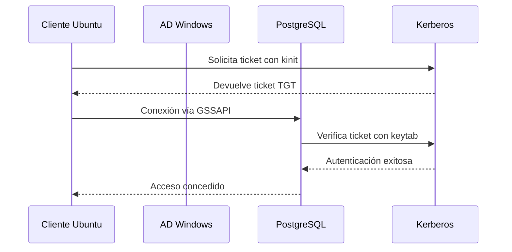

## **Beneficios de la autenticación Kerberos (GSSAPI) en PostgreSQL**

Si tu entorno utiliza Active Directory y buscas una forma segura y eficiente de autenticar usuarios en PostgreSQL, la autenticación mediante **Kerberos (GSSAPI)** es altamente recomendable frente a LDAP. A continuación, se detallan sus principales ventajas:

### 🔐 Seguridad reforzada
Kerberos proporciona un nivel superior de seguridad, ya que **las credenciales no se transmiten en texto plano** durante el proceso de autenticación. Esto minimiza el riesgo de ataques de interceptación y exposición de contraseñas.

### 🧩 Integración nativa con Active Directory
La autenticación Kerberos se **integra de forma directa con Active Directory**, permitiendo reutilizar las cuentas de usuario existentes y aprovechar la infraestructura de seguridad ya implementada, sin necesidad de duplicar la gestión de usuarios en PostgreSQL.

### ⚙️ Configuración sencilla
Una vez que Kerberos está correctamente configurado en tu entorno, **habilitarlo en PostgreSQL es relativamente simple**. Los usuarios pueden autenticarse utilizando sus credenciales de Active Directory sin necesidad de ingresar contraseñas adicionales.

### 🚀 Mayor eficiencia
Kerberos utiliza **tickets de autenticación** para validar el acceso, lo que permite un proceso más rápido y escalable, especialmente útil en entornos con **gran volumen de usuarios y autenticaciones frecuentes**.


# 🧾 Manual Técnico: Autenticación GSSAPI desde Ubuntu a PostgreSQL en Ubuntu con Active Directory

***

## 📘 1. Índice

1.  Objetivo
2.  Requisitos
3.  ¿Qué es GSSAPI?
4.  Ventajas y Desventajas
5.  Casos de Uso
6.  Simulación empresarial
7.  Estructura semántica
8.  Visualización
9.  Procedimientos
    *   9.1 Configuración del servidor Windows (AD)
    *   9.2 Configuración del servidor PostgreSQL en Ubuntu
    *   9.3 Configuración del cliente Ubuntu
    *   9.4 Pruebas de conexión
10. Consideraciones
11. Buenas prácticas
12. Recomendaciones
13. Otros tipos
14. Tabla comparativa
15. Bibliografía

***

## 🎯 2. Objetivo

Permitir que los usuarios del dominio **crony.com** se conecten desde un cliente **Ubuntu** a un servidor **PostgreSQL en Ubuntu** usando **autenticación GSSAPI/Kerberos**, sin ingresar credenciales, aprovechando su sesión Kerberos.

***

## ✅ 3. Requisitos

*   Servidor Windows con Active Directory: `172.17.0.4`
*   Servidor PostgreSQL en Ubuntu: `172.18.0.4`
*   Cliente Ubuntu: `172.19.0.4`
*   PostgreSQL 13 o superior (compilado con soporte GSSAPI)
*   Dominio configurado: `crony.com`
*   NetBIOS: `CRONYNETBIOS`
*   Cuenta de servicio en AD: `postgres_svc`
*   Herramienta `setspn.exe` disponible
*   Cliente Ubuntu unido al dominio o con acceso a Kerberos (`krb5.conf`)
*   Paquetes: `krb5-user`, `libpq-dev`, `postgresql`, `gss-ntlmssp`

***

## ❓ 4. ¿Qué es GSSAPI?

**GSSAPI** (Generic Security Services API) es una interfaz que permite a aplicaciones como PostgreSQL usar mecanismos de autenticación como Kerberos. En entornos Linux, GSSAPI se usa para validar usuarios que ya tienen un ticket Kerberos válido.

***

## ⚖️ 5. Ventajas y Desventajas

**Ventajas:**

*   Seguridad centralizada
*   No requiere ingresar credenciales
*   Compatible con políticas de AD

**Desventajas:**

*   Requiere configuración Kerberos en Linux
*   Puede ser complejo de depurar
*   Depende de sincronización de tiempo (NTP)

***


## 🧪 6. Simulación empresarial

**Empresa:** Grupo Crony\
**Dominio:** `crony.com`\
**NetBIOS:** `CRONYNETBIOS`\
**Servidor Windows AD:** `172.17.0.4`\
**Servidor PostgreSQL (Ubuntu):** `172.18.0.4`\
**Cliente Ubuntu:** `172.19.0.4`\
**Usuario de dominio:** `juan.perez@crony.com`\
**Cuenta de servicio PostgreSQL:** `postgres_svc`

***
 
## 🖼️ 8. Visualización

***

## 🧠 10. Consideraciones

### 🔹 Accesos requeridos por host

| Host           | IP           | Requiere acceso a         | Tipo de acceso  | Justificación                             |
| -------------- | ------------ | ------------------------- | --------------- | ----------------------------------------- |
| Cliente Ubuntu | `172.19.0.4` | AD (`172.17.0.4`)         | TCP/UDP 88, 389 | Obtener ticket Kerberos y resolución LDAP |
|                |              | PostgreSQL (`172.18.0.4`) | TCP 5432        | Conexión a base de datos                  |
| PostgreSQL     | `172.18.0.4` | AD (`172.17.0.4`)         | TCP/UDP 88      | Validación de tickets                     |
| AD             | `172.17.0.4` | Todos                     | TCP/UDP 88, 389 | KDC y LDAP                                |


### 🔹 Configuración de `/etc/hosts`

```bash
# /etc/hosts
172.17.0.4    ad.crony.com
172.18.0.4    dbserver.crony.com
172.19.0.4    client.crony.com
```


## 🛠️ 9. Procedimientos

### 🔹 9.1 Configuración del servidor Windows (AD)

#### 1. Crear cuenta de servicio en AD

```powershell
New-ADUser -Name "postgres_svc" `
           -SamAccountName "postgres_svc" `
           -UserPrincipalName "postgres_svc@crony.com" `
           -Path "OU=Servicios,DC=crony,DC=com" `
           -AccountPassword (ConvertTo-SecureString "P@ssw0rd123" -AsPlainText -Force) `
           -Enabled $true
```

#### 2. Crear cuenta de usuario

```powershell
New-ADUser `
    -Name "Juan Perez" `
    -GivenName "Juan" `
    -Surname "Perez" `
    -SamAccountName "juan.perez" `
    -UserPrincipalName "juan.perez@crony.com" `
    -EmailAddress "juan.perez@crony.com" `
    -AccountPassword (ConvertTo-SecureString "ContraseñaSegura#2025" -AsPlainText -Force) `
    -Path "OU=Servicios,DC=crony,DC=com" `
    -Enabled $true `
    -ChangePasswordAtLogon $true `
    -PasswordNeverExpires $false `
    -PassThru
```

### Ver los usuarios 
```powershell
Get-ADUser -Identity juan.perez
Get-ADUser -Identity postgres_svc
```

#### 3. Registrar SPN

```powershell
setspn -S POSTGRES/dbserver.crony.com CRONYNETBIOS\postgres_svc
```


#### 2. Generar archivo keytab en Windows

```powershell
ktpass  `
   -princ postgres/dbserver.crony.com@CRONY.COM  `
   -mapuser postgres_svc@crony.com  `
   -pass ContraseñaSegura#2025  `
   -crypto RC4-HMAC-NT  `
   -ptype KRB5_NT_PRINCIPAL  `
   -kvno 5 -out postgres.keytab

-princ: Principal Kerberos que usará PostgreSQL.
-mapuser: Usuario de servicio en Active Directory.
-crypto RC4-HMAC-NT: Tipo de cifrado compatible con muchos clientes Linux.
-ptype KRB5_NT_PRINCIPAL: Tipo de principal.
-kvno 5: Versión de clave (debe coincidir con el ticket).
-out: Ruta del archivo keytab generado.
```

#### 3. Transferir  el keytab en Ubuntu

```bash
scp C:\Users\crony\Desktop\postgres.keytab crony@172.18.0.4:/home/crony/
```

***

### 🔹 9.2 Configuración del servidor PostgreSQL en Ubuntu

#### 1. Instalar PostgreSQL con soporte GSSAPI

```bash
sudo apt-get update 
sudo apt-get install krb5-user libpq-dev gss-ntlmssp
```

#### . Mover y darle permisos a keytab
```bash
mv /home/crony/postgres.keytab /var/lib/postgresql/data/

sudo chown postgres:postgres /var/lib/postgresql/data/postgres.keytab
sudo chmod 600 /var/lib/postgresql/data/postgres.keytab
```

 

6. Configurar PostgreSQL (postgresql.conf):
```ini
listen_addresses = '*'
krb_server_keyfile = '/var/lib/postgresql/data/postgres.keytab'


postgres@postgres# select name,setting from pg_settings where name ~* 'krb|gss';
+-----------------------+---------------------------------------+
|         name          |                setting                |
+-----------------------+---------------------------------------+
| gss_accept_delegation | off                                   |
| krb_caseins_users     | off                                   |
| krb_server_keyfile    | FILE:/etc/sysconfig/pgsql/krb5.keytab |
+-----------------------+---------------------------------------+
(3 rows)

```

#### 5. Configurar `pg_hba.conf`

```conf
hostgssenc    all     all     172.19.0.4/32       gss include_realm=1 map=winmap
```

#### 6. Configurar `pg_ident.conf`

```conf
winmap    juan.perez@CRONY.COM    juan
```

#### 7. Crear rol en PostgreSQL

```bash
sudo -u postgres psql
```

```sql
CREATE USER juan;
```

#### 8. Reiniciar PostgreSQL

```bash
/usr/lib/postgresql/16/bin/pg_ctl reload -D /var/lib/postgresql/data
```

***

### 🔹 9.3 Configuración del cliente Ubuntu

#### 1. Instalar paquetes necesarios

```bash
sudo apt update
sudo apt-get install postgresql-client krb5-user libpam-krb5 libpam-ccreds libpq-dev gss-ntlmssp
```

#### 2. Configurar `/etc/krb5.conf`

```ini
[libdefaults]
    default_realm = CRONY.COM
    dns_lookup_realm = false
    dns_lookup_kdc = false

[realms]
    CRONY.COM = {
        kdc = ad.crony.com
        admin_server = ad.crony.com
    }

[domain_realm]
    .crony.com = CRONY.COM
    crony.com = CRONY.COM
```

#### 3. Obtener ticket Kerberos
Solicitara contraseña 
```bash
kinit  -V juan.perez@CRONY.COM

****** Salida Terminal  *********
Using default cache: /tmp/krb5cc_1000_sMeWLl
Using principal: juan.perez@CRONY.COM
Password for juan.perez@CRONY.COM:
Authenticated to Kerberos v5
```


#### 4. Verificar ticket

```bash
klist -f

**Simulación de salida:**
Ticket cache: FILE:/tmp/krb5cc_1000_sMeWLl
Default principal: juan.perez@CRONY.COM

Valid starting     Expires            Service principal
09/18/25 04:19:15  09/18/25 14:19:15  krbtgt/CRONY.COM@CRONY.COM
        renew until 09/19/25 04:19:08, Flags: FPRIA
```


#### En caso de ser necesario, limpiar las credenciasles de la cache
```
kdestroy -A
```
 
#### 5. Conectarse a PostgreSQL

```bash
psql "host=dbserver.crony.com user=juan dbname=postgres sslmode=prefer gssencmode=prefer"
```
  
***

### Valiar los datos de GSSAPI
```
SELECT
    a.pid,
    a.usename,
    a.application_name,
    a.client_addr,
    a.backend_start,
    g.principal,
	g.gss_authenticated,
    g.encrypted
FROM
    pg_stat_activity a
JOIN
    pg_stat_gssapi g ON a.pid = g.pid
WHERE
    g.gss_authenticated IS TRUE;
```


### 🔹 Validaciones  adicionales

```bash
ping ad.crony.com
ping dbserver.crony.com
```

```bash
kinit juan.perez@CRONY.COM
klist
klist -f
```

***

## 🧪 11. Buenas prácticas

*   Usar cuentas de servicio dedicadas
*   Validar SPN y permisos
*   Configurar correctamente `krb5.conf`
*   Usar FQDN en la conexión

***

## ✅ 12. Recomendaciones

*   Usar `pg_ident.conf` para mapear usuarios
*   Automatizar la creación de roles con herramientas como `pg-ldap-sync`
*   Validar tickets con `klist` antes de conectar

***


#### ✅ Verifica SPN en AD

```cmd
setspn -Q POSTGRES/dbserver.crony.com
```

Debe devolver:

```plaintext
Registered ServicePrincipalNames for CN=postgres_svc,...
POSTGRES/dbserver.crony.com
```

#### ✅ Verifica sincronización de hora en linux 

```bash
sudo apt install ntpdate
sudo ntpdate ad.crony.com
```

3.  **Verifica que el nombre del host coincida con el SPN:**

```bash
hostname -f
```


### 🧪 ¿Cómo confirmar que el keytab es válido?

Después de copiar el nuevo keytab, ejecuta:

```bash
sudo -u postgres kinit -k -t /var/lib/postgresql/data/postgres.keytab postgres/dbserver.crony.com@CRONY.COM
```


- Reestablece la contraseña del usuario de servicio `postgres_svc` solo si es necesario:
 ```powershell
 Set-ADAccountPassword -Identity "postgres_svc"
 ```


### Verifica los tipos de cifrado en el keytab
```
sudo -u postgres klist -k -t -K /var/lib/postgresql/data/postgres.keytab
```


### cosas extras 
 En caso de ser necesario puedes validar los logs 
 ```
 tail -f  /var/lib/postgresql/data/log/postgresql-2025-09-14.log
 ```

## 🔍 ¿Por qué no usar gMSA en Linux?

Las **gMSA (Group Managed Service Accounts)** están diseñadas para ser utilizadas **exclusivamente en sistemas Windows**. Su gestión automática de contraseñas y permisos depende de componentes del sistema operativo Windows que **no están disponibles en Linux**.

Linux no tiene soporte nativo para recuperar la contraseña de una gMSA desde Active Directory, lo cual es necesario para generar el archivo `keytab` que PostgreSQL usa para autenticarse con Kerberos.


### 🔍 ¿Por qué es importante la sincronización de tiempo?

Kerberos es **muy sensible al tiempo**. Cuando un cliente solicita un ticket de autenticación, el servidor (KDC, en este caso el Active Directory) verifica que la hora del cliente esté dentro de un rango aceptable (por defecto, ±5 minutos). Si hay una diferencia mayor, el ticket se considera inválido y se rechaza la autenticación. - Esto puede provocar errores como:
  - `Clock skew too great`
  - `KRB5KRB_AP_ERR_SKEW`
  - Fallos en la autenticación GSSAPI en PostgreSQL.
 

### ✅ ¿Qué es `kvno`?

**KVNO (Key Version Number)** es un número que indica la **versión actual de la clave secreta** asociada a un principal Kerberos. Cada vez que se cambia la contraseña de una cuenta de servicio (por ejemplo, `postgres_svc`), el KDC (Key Distribution Center) incrementa el `kvno`.

Este número es **crítico** para que el archivo `keytab` funcione correctamente, ya que el ticket Kerberos debe coincidir con la versión de clave que el servidor PostgreSQL tiene registrada.

```
kvno postgres/dbserver.crony.com@CRONY.COM

**** Salida terminal ****
postgres/dbserver.crony.com@CRONY.COM: kvno = 8
```

## **Cifrado GSSAPI vs. Cifrado SSL en PostgreSQL**

Cuando se trata de proteger las comunicaciones entre el cliente y el servidor en PostgreSQL, existen dos mecanismos principales de cifrado: **GSSAPI** (usualmente con Kerberos) y **SSL**. Ambos ofrecen seguridad, pero tienen diferencias clave en su funcionamiento e integración.

### 🔐 1. Cifrado GSSAPI

- **GSSAPI (Generic Security Services Application Program Interface)** es una interfaz que permite a las aplicaciones utilizar mecanismos de autenticación como **Kerberos**, proporcionando tanto autenticación como cifrado.
- Si el cifrado GSSAPI está disponible, PostgreSQL lo utilizará automáticamente para **proteger la autenticación y la transmisión de datos**, sin requerir configuración adicional en el cliente.
- Es ideal en entornos corporativos con Active Directory, donde Kerberos ya está implementado.

### 🔒 2. Cifrado SSL

- **SSL (Secure Sockets Layer)** es un protocolo estándar ampliamente utilizado para cifrar conexiones en redes.
- PostgreSQL soporta SSL para proteger la transmisión de datos, incluso si no se utiliza Kerberos.
- Requiere certificados y configuración explícita en el servidor y el cliente.

---

## **Configuración de `sslmode` y `gssencmode`**

PostgreSQL permite controlar el comportamiento del cifrado mediante dos parámetros clave:

- **`sslmode`**: Define cómo se maneja el cifrado SSL. Valores posibles:
  - `disable`, `allow`, `prefer`, `require`, `verify-ca`, `verify-full`.

- **`gssencmode`**: Controla el uso del cifrado GSSAPI. Valores posibles:
  - `disable`, `allow`, `prefer`, `require`.


## **Interacción entre `sslmode` y `gssencmode`**

- **Prioridad de GSSAPI**: Si el cifrado GSSAPI está disponible y habilitado, PostgreSQL lo utilizará **por encima de SSL**, independientemente del valor de `sslmode`.
- **Forzar el uso de SSL**: Para obligar a PostgreSQL a usar SSL en lugar de GSSAPI (por ejemplo, en entornos Kerberos donde se prefiere SSL), debes establecer:
  ```ini
  gssencmode=disable
  ```
  Esto desactiva el cifrado GSSAPI y permite que SSL se utilice según lo definido en `sslmode`.


## 🔄 13. Otros tipos

*   Autenticación LDAP directa
*   Kerberos puro (más complejo)
*   Certificados SSL + LDAP

***

## 📊 14. Tabla comparativa

| Método       | Seguridad | Facilidad | Requiere AD | Recomendado para |
| ------------ | --------- | --------- | ----------- | ---------------- |
| GSSAPI       | Alta      | Media     | Sí          | Linux + AD       |
| SSPI         | Alta      | Media     | Sí          | Windows          |
| LDAP         | Media     | Alta      | No          | Mixto            |
| Certificados | Alta      | Baja      | No          | Alta seguridad   |

***

## 📚 15. Bibliografía
```
[https://www.highgo.ca/2020/03/26/postgresql-gssapi-authentication-with-kerberos-part-2-postgresql-configuration/](https://www.highgo.ca/2020/03/18/postgresql-gssapi-authentication-with-kerberos-part-1-how-to-setup-kerberos-on-ubuntu/

https://www.highgo.ca/2020/03/26/postgresql-gssapi-authentication-with-kerberos-part-2-postgresql-configuration/

https://www.highgo.ca/2020/03/30/postgresql-gssapi-authentication-with-kerberos-part-3-the-status-of-authentication-encryption-and-user-principal/)

https://www.hagander.net/talks/Deploying%20PostgreSQL%20in%20a%20Windows%20Enterprise.pdf

Referencia: 
	https://www.postgresql.org/docs/current/gssapi-enc.html
	https://www.postgresql.org/docs/current/gssapi-auth.html
	https://www.postgresql.org/docs/current/libpq-connect.html#LIBPQ-CONNECT-SSLMODE
	https://www.postgresql.org/docs/current/auth-pg-hba-conf.html
	https://www.postgresql.org/docs/current/encryption-options.html


https://github.com/SamerBenMim/kerberos-postgres-auth-gssapi
https://www.enterprisedb.com/blog/how-set-kerberos-authentication-using-active-directory-postgresql-database

https://community.microstrategy.com/s/article/Use-case-for-Kerberos-against-PostgreSQL-on-MSTR?language=en_US

https://www.crunchydata.com/blog/windows-active-directory-postgresql-gssapi-kerberos-authentication

https://idrawone.github.io/2020/03/11/PostgreSQL-GSSAPI-Authentication-with-Kerberos-part-1/
https://idrawone.github.io/2020/03/12/PostgreSQL-GSSAPI-Authentication-with-Kerberos-part-2/
https://idrawone.github.io/2020/03/15/PostgreSQL-GSSAPI-Authentication-with-Kerberos-part-3/

https://medium.com/@yosra.dridi270/configuration-of-postgresql-authentication-with-kerberos-16b66948a2c3


https://docs.redhat.com/en/documentation/red_hat_directory_server/11/html/administration_guide/configuring_kerberos#Configuring_Kerberos
https://docs.redhat.com/en/documentation/red_hat_amq/2020.q4/html/using_amq_streams_on_rhel/assembly-kerberos_str#kerberos-setting-up_str
https://docs.redhat.com/es/documentation/red_hat_data_grid/6.6/html/security_guide/active_directory_authentication_using_kerberos_gssapi#Active_Directory_Authentication_Using_Kerberos_GSSAPI


https://www.percona.com/blog/postgresql-database-security-external-server-based-authentication/
https://docs.vmware.com/en/VMware-Greenplum/7/greenplum-database/admin_guide-kerberos.html
https://www.cockroachlabs.com/docs/stable/gssapi_authentication
https://stackoverflow.com/questions/63469679/log-connection-failed-during-start-up-processing-user-database-fatal-gssapi


https://www.initmax.cz/wp-content/uploads/2024/06/enterprise-solution-in-postgresql_efficient-and-flexible-access-management.pdf
https://h50146.www5.hpe.com/products/software/oe/linux/mainstream/support/lcc/pdf/PostgreSQL16Beta1_New_Features_en_20230528_1.pdf 
https://postgresconf.org/system/events/document/000/000/183/pgconf_us_v4.pdf 

 
Kerberos and Active Directory setup in pgAdmin 4  https://www.youtube.com/watch?v=Z2-V0THRyY0
Kerberos Authentication Setup With Postgres on Linux https://www.youtube.com/watch?v=dvYkcZATY6k
Beyond Trust - PostgreSQL Client Authentication   https://www.youtube.com/watch?v=RiEFy_jiU_c
Michael Paquier: Authentication in PostgreSQL -- PGCon 2018   https://www.youtube.com/watch?v=aByfTbEs7cg

pg_admin -> https://www.enterprisedb.com/blog/pgadmin-kerberos-active-directory

*   <https://www.postgresql.org/docs/current/auth-gssapi.html>
*   <https://wiki.debian.org/Kerberos>
*   <https://github.com/larskanis/pg-ldap-sync>
*   <https://learn.microsoft.com/en-us/windows-server/administration/windows-commands/setspn>
```
 
