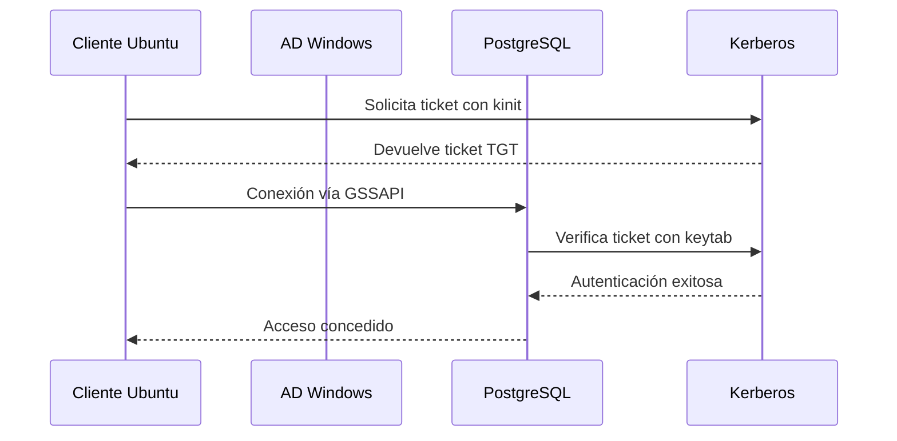

# 🧾 Manual Técnico: Autenticación GSSAPI desde Ubuntu a PostgreSQL en Ubuntu con Active Directory

***

## 📘 1. Índice

1.  Objetivo
2.  Requisitos
3.  ¿Qué es GSSAPI?
4.  Ventajas y Desventajas
5.  Casos de Uso
6.  Simulación empresarial
7.  Estructura semántica
8.  Visualización
9.  Procedimientos
    *   9.1 Configuración del servidor Windows (AD)
    *   9.2 Configuración del servidor PostgreSQL en Ubuntu
    *   9.3 Configuración del cliente Ubuntu
    *   9.4 Pruebas de conexión
10. Consideraciones
11. Buenas prácticas
12. Recomendaciones
13. Otros tipos
14. Tabla comparativa
15. Bibliografía

***

## 🎯 2. Objetivo

Permitir que los usuarios del dominio **crony.com** se conecten desde un cliente **Ubuntu** a un servidor **PostgreSQL en Ubuntu** usando **autenticación GSSAPI/Kerberos**, sin ingresar credenciales, aprovechando su sesión Kerberos.

***

## ✅ 3. Requisitos

*   Servidor Windows con Active Directory: `172.17.0.4`
*   Servidor PostgreSQL en Ubuntu: `172.18.0.4`
*   Cliente Ubuntu: `172.19.0.4`
*   PostgreSQL 13 o superior (compilado con soporte GSSAPI)
*   Dominio configurado: `crony.com`
*   NetBIOS: `CRONYNETBIOS`
*   Cuenta de servicio en AD: `postgres_svc`
*   Herramienta `setspn.exe` disponible
*   Cliente Ubuntu unido al dominio o con acceso a Kerberos (`krb5.conf`)
*   Paquetes: `krb5-user`, `libpq-dev`, `postgresql`, `gss-ntlmssp`

***

## ❓ 4. ¿Qué es GSSAPI?

**GSSAPI** (Generic Security Services API) es una interfaz que permite a aplicaciones como PostgreSQL usar mecanismos de autenticación como Kerberos. En entornos Linux, GSSAPI se usa para validar usuarios que ya tienen un ticket Kerberos válido.

***

## ⚖️ 5. Ventajas y Desventajas

**Ventajas:**

*   Seguridad centralizada
*   No requiere ingresar credenciales
*   Compatible con políticas de AD

**Desventajas:**

*   Requiere configuración Kerberos en Linux
*   Puede ser complejo de depurar
*   Depende de sincronización de tiempo (NTP)

***

## 🧪 6. Simulación empresarial

**Empresa:** Grupo Crony\
**Dominio:** `crony.com`\
**NetBIOS:** `CRONYNETBIOS`\
**Servidor Windows AD:** `172.17.0.4`\
**Servidor PostgreSQL (Ubuntu):** `172.18.0.4`\
**Cliente Ubuntu:** `172.19.0.4`\
**Usuario de dominio:** `juan.perez@crony.com`\
**Cuenta de servicio PostgreSQL:** `postgres_svc`

***

## 🧱 7. Estructura semántica

*   Dominio: `crony.com`
*   NetBIOS: `CRONYNETBIOS`
*   SPN: `POSTGRES/dbserver.crony.com`
*   Usuario mapeado: `CRONYNETBIOS\juan.perez` → rol `juan` en PostgreSQL

***

## 🖼️ 8. Visualización

***

## 🛠️ 9. Procedimientos

### 🔹 9.1 Configuración del servidor Windows (AD)

#### 1. Crear cuenta de servicio en AD

```powershell
New-ADUser -Name "postgres_svc" `
           -SamAccountName "postgres_svc" `
           -UserPrincipalName "postgres_svc@crony.com" `
           -Path "OU=Servicios,DC=crony,DC=com" `
           -AccountPassword (ConvertTo-SecureString "ContraseñaSegura#2025" -AsPlainText -Force) `
           -Enabled $true
```

#### 2. Crear cuenta de usuario

```powershell
New-ADUser `
    -Name "Juan Perez" `
    -GivenName "Juan" `
    -Surname "Perez" `
    -SamAccountName "juan.perez" `
    -UserPrincipalName "juan.perez@crony.com" `
    -EmailAddress "juan.perez@crony.com" `
    -AccountPassword (ConvertTo-SecureString "ContraseñaSegura#2025" -AsPlainText -Force) `
    -Path "OU=Servicios,DC=crony,DC=com" `
    -Enabled $true `
    -ChangePasswordAtLogon $true `
    -PasswordNeverExpires $false `
    -PassThru
```

#### 3. Registrar SPN

```cmd
setspn -S POSTGRES/dbserver.crony.com CRONYNETBIOS\postgres_svc
```

***

### 🔹 9.2 Configuración del servidor PostgreSQL en Ubuntu

#### 1. Instalar PostgreSQL con soporte GSSAPI

```bash
sudo apt-get update 
sudo apt-get install postgresql-client krb5-user libpq-dev gss-ntlmssp
```

#### 2. Generar archivo keytab en Windows

```bash
ktpass -princ postgres/dbserver.crony.com@CRONY.COM -mapuser postgres_svc@crony.com -pass ContraseñaSegura#2025 -crypto RC4-HMAC-NT -ptype KRB5_NT_PRINCIPAL -kvno 5 -out postgres.keytab
```

#### 3. Transferir y configurar el keytab en Ubuntu

```bash
scp C:\Users\crony\Desktop\postgres.keytab crony@172.18.0.4:/home/crony/
mv /home/crony/postgres.keytab /var/lib/postgresql/data/
sudo chown postgres:postgres /var/lib/postgresql/data/postgres.keytab
sudo chmod 600 /var/lib/postgresql/data/postgres.keytab
```

#### 4. Configurar `postgresql.conf`

```conf
krb_server_keyfile = '/var/lib/postgresql/data/postgres.keytab'
```

#### 5. Configurar `pg_hba.conf`

```conf
hostgssenc    all     all     172.19.0.4/32       gss include_realm=1 map=winmap
```

#### 6. Configurar `pg_ident.conf`

```conf
winmap    juan.perez@CRONY.COM    juan
```

#### 7. Crear rol en PostgreSQL

```bash
sudo -u postgres psql
```

```sql
CREATE ROLE juan LOGIN;
```

#### 8. Reiniciar PostgreSQL

```bash
/usr/lib/postgresql/16/bin/pg_ctl reload -D /var/lib/postgresql/data
```

***

### 🔹 9.3 Configuración del cliente Ubuntu

#### 1. Instalar paquetes necesarios

```bash
sudo apt update
sudo apt-get install postgresql-client krb5-user libpam-krb5 libpam-ccreds libpq-dev gss-ntlmssp
```

#### 2. Configurar `/etc/krb5.conf`

```ini
[libdefaults]
    default_realm = CRONY.COM
    dns_lookup_realm = false
    dns_lookup_kdc = false

[realms]
    CRONY.COM = {
        kdc = ad.crony.com
        admin_server = ad.crony.com
    }

[domain_realm]
    .crony.com = CRONY.COM
    crony.com = CRONY.COM
```

#### 3. Obtener ticket Kerberos

```bash
kinit juan.perez@CRONY.COM
```

**Simulación de salida:**

    Password for juan.perez@CRONY.COM:
    Authenticated to Kerberos v5

#### 4. Verificar ticket

```bash
klist
```

**Simulación de salida:**

    Ticket cache: FILE:/tmp/krb5cc_1000
    Default principal: juan.perez@CRONY.COM
    Valid starting       Expires              Service principal
    17/09/25 12:00:00  17/09/25 22:00:00  krbtgt/CRONY.COM@CRONY.COM

#### 5. Conectarse a PostgreSQL

```bash
psql "host=dbserver.crony.com user=juan dbname=postgres sslmode=prefer gssencmode=prefer"
```

**Simulación de salida:**

    Bienvenido a psql 15.0
    Conectado a la base de datos "postgres" como usuario "juan"

***

## 🧠 10. Consideraciones

*   Validar conectividad entre hosts
*   Configurar correctamente `/etc/hosts`
*   Verificar SPN y sincronización de hora
*   Confirmar validez del keytab

***

## 🧪 11. Buenas prácticas

*   Usar cuentas de servicio dedicadas
*   Validar SPN y permisos
*   Configurar correctamente `krb5.conf`
*   Usar FQDN en la conexión

***

## ✅ 12. Recomendaciones

*   Usar `pg_ident.conf` para mapear usuarios
*   Automatizar roles con `pg-ldap-sync`
*   Validar tickets con `klist` antes de conectar

***

## 🔄 13. Otros tipos

*   Autenticación LDAP directa
*   Kerberos puro
*   Certificados SSL + LDAP

***

## 📊 14. Tabla comparativa

| Método       | Seguridad | Facilidad | Requiere AD | Recomendado para |
| ------------ | --------- | --------- | ----------- | ---------------- |
| GSSAPI       | Alta      | Media     | Sí          | Linux + AD       |
| SSPI         | Alta      | Media     | Sí          | Windows          |
| LDAP         | Media     | Alta      | No          | Mixto            |
| Certificados | Alta      | Baja      | No          | Alta seguridad   |

***

## 📚 15. Bibliografía

*   <https://www.postgresql.org/docs/current/auth-gssapi.html>
*   <https://wiki.debian.org/Kerberos>
*   <https://github.com/larskanis/pg-ldap-sync>
*   <https://learn.microsoft.com/en-us/windows-server/administration/windows-commands/setspn>

***
 
