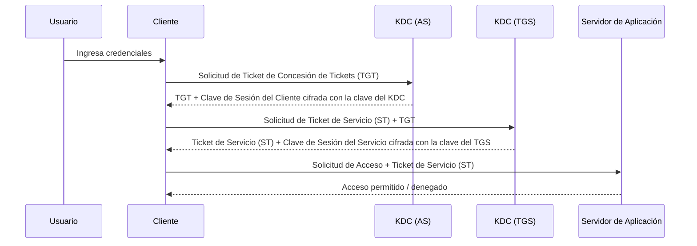

NTLM (New Technology LAN Manager) y Kerberos son dos protocolos de autenticación que se utilizan en redes para verificar la identidad de los usuarios y equipos. 

### NTLM (New Technology LAN Manager)

#### Características:
- **Desarrollado por Microsoft**: NTLM es un protocolo propietario de Microsoft utilizado principalmente en sistemas Windows.
- **Método de autenticación basado en desafíos**: NTLM utiliza un método de autenticación de desafío-respuesta para verificar la identidad de los usuarios.
- **Versiones**: Existen varias versiones de NTLM, siendo NTLMv1 y NTLMv2 las más conocidas, con NTLMv2 ofreciendo mayores niveles de seguridad.

#### Funcionamiento:
1. El cliente envía una solicitud de inicio de sesión al servidor.
2. El servidor responde con un desafío (un valor aleatorio).
3. El cliente cifra el desafío utilizando un hash de la contraseña del usuario y envía la respuesta cifrada al servidor.
4. El servidor compara la respuesta cifrada con su propia versión cifrada para verificar la autenticidad.

### Kerberos

#### Características:
- **Desarrollado por el MIT**: Kerberos es un protocolo de autenticación de red que fue desarrollado por el Instituto de Tecnología de Massachusetts (MIT).
- **Basado en tickets**: Utiliza un sistema de tickets para autenticar usuarios y servicios en una red.
- **Mayor seguridad**: Kerberos ofrece mayor seguridad en comparación con NTLM al utilizar cifrado simétrico y claves de sesión temporales.

#### Funcionamiento:
1. El cliente solicita un Ticket Granting Ticket (TGT) al servidor de autenticación (AS) presentando su credencial.
2. El AS verifica la credencial y emite un TGT cifrado con una clave que solo el cliente y el AS conocen.
3. El cliente utiliza el TGT para solicitar un ticket de servicio (ST) del servidor de concesión de tickets (TGS) para acceder a un servicio específico.
4. El TGS emite el ST cifrado que el cliente presenta al servidor del servicio para obtener acceso.

### Diferencias Principales

| Característica          | NTLM                             | Kerberos                         |
|-------------------------|----------------------------------|----------------------------------|
| **Origen**              | Microsoft                        | MIT                              |
| **Método de Autenticación** | Desafío-Respuesta                | Basado en Tickets                 |
| **Seguridad**           | Menor nivel de seguridad         | Mayor nivel de seguridad         |
| **Compatibilidad**      | Principalmente sistemas Windows  | Multiplataforma (Windows, UNIX)  |
| **Uso de Claves**       | Hash de contraseñas              | Cifrado simétrico y claves de sesión temporales |

 
### Diagrama de Secuencia de Kerberos



### Explicación del Diagrama

1. **Usuario ingresa credenciales:**
   - El usuario introduce sus credenciales (nombre de usuario y contraseña) en el cliente (por ejemplo, una estación de trabajo o un dispositivo).

2. **Solicitud de TGT (Ticket de Concesión de Tickets):**
   - El cliente toma las credenciales del usuario y envía una solicitud de TGT al servidor de autenticación (AS) del Centro de Distribución de Claves (KDC).

3. **Emisión de TGT:**
   - El servidor de autenticación (AS) verifica las credenciales del usuario. Si son válidas, emite un TGT y una clave de sesión del cliente cifrada con la clave del KDC.
   - El TGT contiene la identidad del usuario, una marca de tiempo y una clave de sesión temporal.

4. **Solicitud de Ticket de Servicio (ST):**
   - El cliente utiliza el TGT para solicitar un Ticket de Servicio (ST) del servidor de concesión de tickets (TGS) del KDC. Esta solicitud incluye el TGT y la identidad del servicio al que el usuario desea acceder.

5. **Emisión de Ticket de Servicio (ST):**
   - El servidor de concesión de tickets (TGS) verifica el TGT. Si es válido, emite un ST y una clave de sesión del servicio cifrada con la clave del TGS.
   - El ST contiene la identidad del usuario, la identidad del servicio, una marca de tiempo y una clave de sesión temporal.

6. **Solicitud de Acceso al Servidor de Aplicación:**
   - El cliente envía una solicitud de acceso al servidor de la aplicación, adjuntando el ST emitido por el TGS.

7. **Acceso Permitido/Denegado:**
   - El servidor de la aplicación verifica el ST. Si es válido y la solicitud es legítima, se concede acceso al usuario.
   - Si hay algún problema con el ST (por ejemplo, ha expirado o es inválido), se deniega el acceso.
 
---

## 🔐 ¿Qué es Kerberos?

Kerberos es un protocolo de autenticación de red que utiliza **criptografía de clave simétrica** y un sistema de **tickets** para permitir que los nodos se comuniquen de forma segura en una red insegura.

---

## 🧠 Flujo semántico entre cliente y servidores

### 1. **Inicio de sesión del cliente**
- El usuario ingresa sus credenciales (usuario + contraseña).
- El cliente (por ejemplo, una PC en dominio) genera una solicitud al **KDC (Key Distribution Center)**, que está en el **Controlador de Dominio (DC)**.

### 2. **Autenticación con el KDC (AS Request/Response)**
- El cliente envía un **AS-REQ (Authentication Service Request)** al KDC.
- El KDC responde con un **AS-REP**, que incluye:
  - Un **Ticket Granting Ticket (TGT)** cifrado con la clave del KDC.
  - Un **session key** cifrado con la clave derivada de la contraseña del usuario.

### 3. **Solicitud de acceso a un servicio (TGS Request/Response)**
- El cliente usa el TGT para solicitar acceso a un servicio (por ejemplo, un servidor de archivos).
- Envía un **TGS-REQ (Ticket Granting Service Request)** al KDC.
- El KDC responde con un **TGS-REP**, que incluye:
  - Un **ticket de servicio** cifrado con la clave del servicio.
  - Una nueva **session key** para comunicarse con el servicio.

### 4. **Acceso al servicio**
- El cliente presenta el **ticket de servicio** al servidor destino (por ejemplo, `\\fileserver`).
- El servidor valida el ticket y permite el acceso si es válido.

---

## 🧩 Semántica clave en cada paso

| Paso | Semántica |
|------|-----------|
| AS-REQ | "Soy el usuario X, quiero autenticación" |
| AS-REP | "Aquí está tu TGT, úsalo para pedir servicios" |
| TGS-REQ | "Quiero acceder al servicio Y, aquí está mi TGT" |
| TGS-REP | "Aquí está tu ticket para el servicio Y" |
| Acceso al servicio | "Aquí está mi ticket, ¿puedo entrar?" |

---

## 🛡️ Seguridad semántica
- **No se envía la contraseña** por la red.
- Los tickets tienen **tiempo de vida limitado**.
- Todo está cifrado con claves simétricas derivadas de contraseñas o almacenadas en el KDC.


# Bibliografía
```
https://medium.com/@yosra.dridi270/configuration-of-postgresql-authentication-with-kerberos-16b66948a2c3
```
