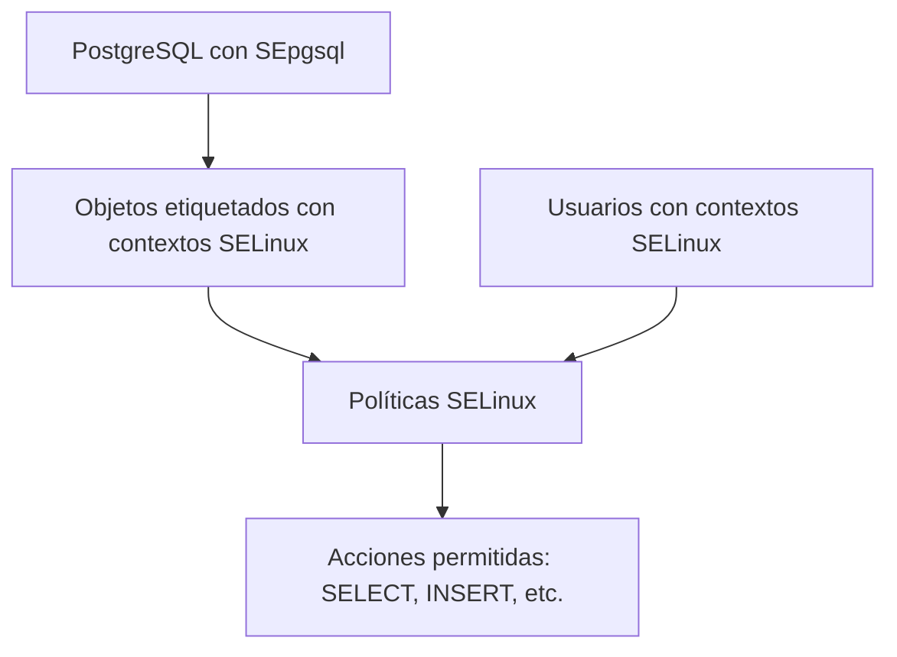

 
## 🧭 1. Índice

1.  Objetivo
2.  Requisitos
3.  ¿Qué es SE-PostgreSQL?
4.  Ventajas y Desventajas
5.  Casos de Uso
6.  Simulación de Empresa
7.  Estructura Semántica
8.  Visualización
9.  Laboratorio Paso a Paso
    *   Verificación de entorno SELinux
    *   Instalación de dependencias
    *   Activación de SEpgsql
    *   Etiquetado de objetos
    *   Creación de políticas SELinux
    *   Pruebas de acceso
10. Consideraciones Finales
11. Buenas Prácticas
12. Recomendaciones
13. Bibliografía

***

## 🎯 2. Objetivo

Implementar **control de acceso obligatorio (MAC)** sobre objetos de PostgreSQL en Ubuntu Linux, utilizando **SELinux** y la extensión **SEpgsql**, para reforzar la seguridad en entornos críticos.

***

## 🧰 3. Requisitos

*   Ubuntu Server 22.04 o superior
*   PostgreSQL instalado y funcionando
*   SELinux instalado y en modo *enforcing*
*   Paquetes: `policycoreutils`, `selinux-policy-dev`, `checkpolicy`, `postgresql-contrib`
*   Acceso root o sudo
*   Conocimientos básicos de PostgreSQL y SELinux

***

## 📌 4. ¿Qué es SE-PostgreSQL?

**SE-PostgreSQL (SEpgsql)** es una extensión que permite aplicar políticas de seguridad de **SELinux** directamente sobre objetos de PostgreSQL (tablas, funciones, esquemas). Esto añade una capa de seguridad obligatoria que no depende de los roles internos de PostgreSQL.

***

## ⚖️ 5. Ventajas y Desventajas

### ✅ Ventajas

*   Seguridad reforzada a nivel de sistema operativo
*   Control granular sobre operaciones SQL
*   Protección contra accesos no autorizados incluso si se compromete PostgreSQL

### ❌ Desventajas

*   Requiere configuración avanzada
*   Poca documentación oficial
*   Necesita que SELinux esté correctamente configurado en Ubuntu (no es el default)

***

## 🏥 6. Simulación de Empresa

**Empresa ficticia:** *ClínicaPrivada MX*\
**Escenario:**\
La clínica gestiona historiales médicos. El usuario `medico_u` debe poder **consultar** la tabla `pacientes`, pero **no modificarla**. El control debe estar definido por políticas SELinux, no por roles de PostgreSQL.

***

## 🧠 7. Estructura Semántica

***

## 🧪 8. Laboratorio Paso a Paso

### 🔍 8.1 Verificar SELinux en Ubuntu

Ubuntu usa AppArmor por defecto, así que primero activamos SELinux:

```bash
# Instalar SELinux
sudo apt update
sudo apt install selinux selinux-policy-default policycoreutils checkpolicy

# Verificar estado
sestatus
```

**Simulación de salida:**

    SELinux status: enabled
    Current mode: enforcing

Si no está en modo *enforcing*, cambia el modo en `/etc/selinux/config`:

```bash
SELINUX=enforcing
```

Reinicia el sistema.

***

### 🔧 8.2 Instalar SEpgsql

Ubuntu no compila PostgreSQL con soporte SELinux por defecto. Necesitamos instalar la extensión manualmente:

```bash
# Instalar contrib
sudo apt install postgresql-contrib

# Activar SEpgsql
sudo -u postgres psql
CREATE EXTENSION sepgsql;
```

**Simulación de salida:**

    CREATE EXTENSION

***

### 🏷️ 8.3 Etiquetar objetos

```sql
-- Crear tabla
CREATE TABLE pacientes (
    id SERIAL PRIMARY KEY,
    nombre TEXT,
    diagnostico TEXT
);

-- Etiquetar con contexto SELinux
SECURITY LABEL FOR selinux ON TABLE pacientes IS 'system_u:object_r:sepgsql_table_t:s0';
```

***

### 🔐 8.4 Crear política SELinux

Creamos una política que permita solo SELECT al usuario `medico_u`.

```bash
# Crear archivo de política
cat <<EOF > sepgsql_medico.te
policy_module(sepgsql_medico, 1.0)

gen_require(`
    type sepgsql_table_t;
    type medico_u;
`)

allow medico_u sepgsql_table_t:db_table { select };
EOF

# Compilar e instalar
checkmodule -M -m -o sepgsql_medico.mod sepgsql_medico.te
semodule_package -o sepgsql_medico.pp -m sepgsql_medico.mod
sudo semodule -i sepgsql_medico.pp
```

***

### 👤 8.5 Asignar contexto al usuario

```bash
# Crear usuario PostgreSQL
sudo -u postgres createuser medico

# Asignar contexto SELinux
sudo semanage login -a -s medico_u medico
```

***

### 🧪 8.6 Pruebas de acceso

```sql
-- Iniciar sesión como medico
psql -U medico

-- Intentar SELECT
SELECT * FROM pacientes;

-- Intentar INSERT
INSERT INTO pacientes (nombre, diagnostico) VALUES ('Luis', 'Hipertensión');
```

**Simulación de resultado:**

*   `SELECT`: ✅ Permitido
*   `INSERT`: ❌ Denegado por política SELinux

***

## 🔚 9. Consideraciones Finales

*   Ubuntu no usa SELinux por defecto, requiere configuración manual.
*   Las políticas deben mantenerse sincronizadas con los objetos de la base de datos.
*   SEpgsql no sustituye los roles, los complementa.

***

## 🧠 10. Buenas Prácticas

*   Documentar cada etiqueta y política aplicada.
*   Validar con `audit2allow` los rechazos para ajustar políticas.
*   Usar nombres semánticos en contextos SELinux.

***

## ✅ 11. Recomendaciones

*   Usar en entornos donde la seguridad es crítica.
*   Integrar con herramientas de auditoría como `auditd`.
*   Evitar aplicar en bases de datos con alta frecuencia de cambios estructurales.

***

## 📚 12. Bibliografía

*   <https://www.postgresql.org/docs/current/sepgsql.html>
*   <https://selinuxproject.org/>
*   <https://wiki.ubuntu.com/SELinux>
 
