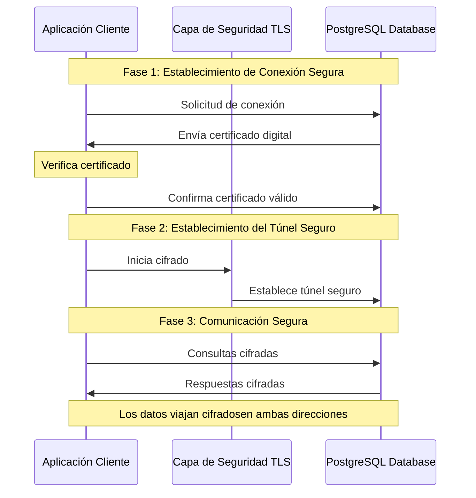
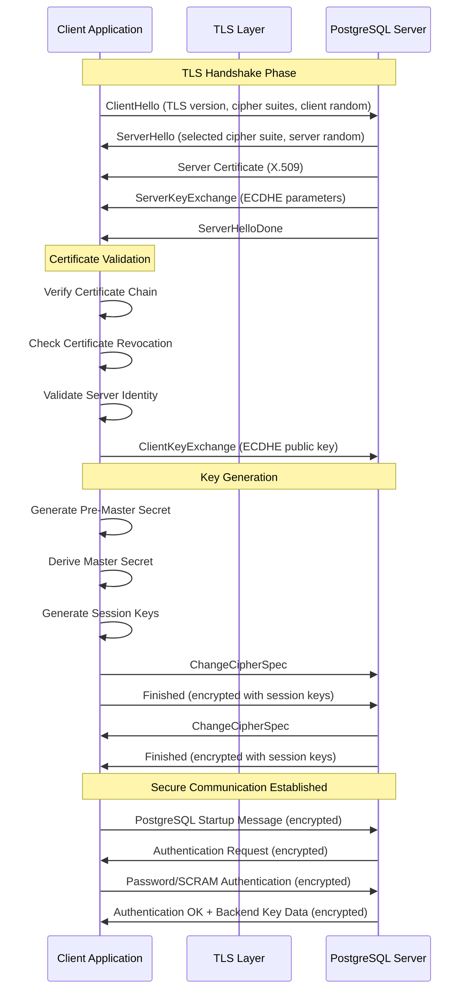

| Modo TLS en el cliente | Num nivel de seguridad | Recomendado | Entornos aplicables | Impacto en Rendimiento | Complejidad de Configuración | Función | Compatible con HOST en pg_hba | Compatible con HOSTSSL en pg_hba | Parámetros necesarios en postgresql.conf | Parámetros necesarios en el cliente/App | Vulnerable a MITM (Man-in-the-Middle) |
|------------------------|------------------------|-------------|---------------------|------------------------|-----------------------------|---------|-------------------------------|----------------------------------|-------------------------------------------|--------------------------------------|-----------------------------------------|
| disable                | 0 - Crítico            | No          | Redes locales aisladas como desarrollo | Ninguno                    | Muy Baja                        | Desactiva la negociación SSL/TLS | Sí                               | No                               | Ninguno                                   | Ninguno                              | Sí                                     |
| allow                  | 2 - Muy alto           | No          | Pruebas, Desarrollo | Muy bajo                | Baja                           | Intenta primero sin SSL, si falla usa SSL/TLS | Sí                               | No                               | `ssl = on`<br>`ssl_cert_file = 'server.crt'`<br>`ssl_key_file = 'server.key'` | Ninguno                              | Sí                                     |
| prefer (Default)       | 4 - Alto riesgo        | No          | Desarrollo, QA       | Media                   | Media                          | Intenta primero con SSL, si falla permite sin SSL/TLS | Sí                               | Sí                               | `ssl = on`<br>`ssl_cert_file = 'server.crt'`<br>`ssl_key_file = 'server.key'` | Ninguno                              | Sí                                     |
| require                | 6 - Medio              | Sí          | Staging, Pre-Producción | Media                   | Media                          | Forza al cliente usar SSL/TLS | Sí                               | Sí                               | `ssl = on`<br>`ssl_cert_file = 'server.crt'`<br>`ssl_key_file = 'server.key'` | Ninguno                              | Sí                                     |
| verify-ca              | 8 - Seguro             | Sí          | Productivos, Sistemas críticos | Media-Alto               | Alta                           | Verifica que el servidor tenga un certificado válido | Sí                               | Sí                               | `ssl = on`<br>`ssl_cert_file = 'server.crt'`<br>`ssl_key_file = 'server.key'`<br>`ssl_ca_file = 'combined.crt'` | `sslmode=verify-ca`<br>`sslrootcert=intermediate_root.crt` | Sí y No (Depende de la política de CA) |
| verify-full            | 10 - Máxima Seguridad  | Sí          | Productivos, Datos Sensibles | Alto                    | Muy alta                       | Verifica el certificado y el host del servidor | Sí                               | Sí                               | `ssl = on`<br>`ssl_cert_file = 'server.crt'`<br>`ssl_key_file = 'server.key'`<br>`ssl_ca_file = 'combined.crt'` | `sslmode=verify-full`<br>`sslrootcert=intermediate_root.crt` | Ninguna conocida                       |

 


# Técnicas de vulnerabilidad 

### 1. **`disable`**
- **Técnica vulnerable**: **"Escuchar como un espía"**  
  - **¿Qué pasa?**: Los datos viajan **sin cifrado** (como texto plano).  
  - **Ataque**: Cualquiera en la misma red (Wi-Fi, internet) puede **leer todo lo que envías o recibes** (contraseñas, datos sensibles).  
  - **Ejemplo**: Es como enviar una carta escrita en un postal: cualquiera que la intercepte puede leerla.

---

### 2. **`allow` / `prefer`**
- **Técnica vulnerable**: **"Engañar para no usar cifrado"**  
  - **¿Qué pasa?**: El cliente dice: *"Prefiero no usar cifrado, pero si el servidor me obliga, lo usaré"*.  
  - **Ataque**: Un atacante puede **hacer creer al cliente que el servidor no soporta cifrado**, forzando una conexión sin SSL.  
  - **Ejemplo**: Es como si un intermediario le dijera a dos personas: *"Háblenme en español, no en su código secreto"*, y ellos obedecen.


### 3. **`require`**
- **Técnica vulnerable**: **"Fingir ser el servidor"**  
  - **¿Qué pasa?**: La conexión **está cifrada**, pero el cliente **no verifica la identidad del servidor**.  
  - **Ataque**: Un atacante puede **crear un servidor falso**, establecer una conexión cifrada con el cliente y otra con el servidor real, actuando como intermediario.  
  - **Ejemplo**: Es como recibir una carta cifrada, pero no verificar quién te la envió. Podría ser tu amigo... o un impostor.


### 4. **`verify-ca`**
- **Técnica vulnerable**: **"Usar un certificado falso de la misma fábrica"**  
  - **¿Qué pasa?**: El cliente verifica que el certificado del servidor está firmado por una **autoridad de confianza (CA)**, pero **no verifica el nombre del servidor**.  
  - **Ataque**: Si un atacante obtiene un certificado válido de la misma CA para otro servidor, puede suplantar al servidor real.  
  - **Ejemplo**: Es como aceptar un documento de identidad falso porque está firmado por una entidad real, aunque el nombre no coincida.


### 5. **`verify-full`**
- **Técnica vulnerable**: **Ninguna (si la CA es de confianza)**  
  - **¿Qué pasa?**: El cliente verifica **dos cosas**:  
    1. El certificado está firmado por una CA confiable.  
    2. El nombre en el certificado **coincide exactamente** con el servidor al que te conectas (ej: `bd.miempresa.com`).  
  - **Protección**: Un atacante necesitaría un certificado válido para el nombre exacto del servidor, lo que es casi imposible si la CA es seria.  
  - **Ejemplo**: Es como verificar no solo que un pasaporte es real, sino también que la foto coincide con la persona que lo tiene.


### **Resumen visual**

| Modo         | Tipo de Ataque                         | ¿Qué aprovecha el atacante?                                 |
|--------------|----------------------------------------|-------------------------------------------------------------|
| `disable`    | Espiar datos en texto plano.           | La falta de cifrado.                                        |
| `allow`/`prefer` | Engañar para no usar cifrado.      | La voluntad del cliente de aceptar conexiones sin SSL.      |
| `require`    | Suplantar al servidor con cifrado.     | La falta de verificación de identidad del servidor.         |
| `verify-ca`  | Usar un certificado válido pero incorrecto. | La CA confiable pero permisiva.                     |
| `verify-full`| **Ninguno** (si todo está bien configurado). | -                                           |


### **¿Por qué algunos modos son vulnerables a MITM?**
La clave está en si el cliente **verifica la identidad del servidor** mediante su certificado SSL/TLS. Si no hay validación, un atacante puede suplantar al servidor.

#### 1. **Modos sin validación de certificado**  
   (`disable`, `allow`, `prefer`, `require`):
   - **No se verifica el certificado del servidor**, aunque la conexión esté cifrada (en `require`).
   - **Riesgo MITM**: Un atacante puede interceptar la conexión y presentar un certificado falso (auto-firmado o de una CA no confiable).  
   - Ejemplo en `require`:  
     Aunque el canal está cifrado, si no validas el certificado, **no sabes si el servidor es legítimo**. Un MITM podría actuar como "proxy" entre tú y el servidor real, descifrando y re-cifrando los datos.

#### 2. **Modos con validación parcial**  
   (`verify-ca`):
   - Verifica que el certificado del servidor está firmado por una **CA de confianza**, pero **no valida el nombre del host** (por ejemplo, `servidor.com`).
   - **Riesgo MITM**: Si un atacante obtiene un certificado válido de la misma CA para otro dominio, podría suplantar al servidor.  
   - Ejemplo: Si tu CA emite certificados para `*.example.com`, un certificado para `atacante.example.com` sería aceptado aunque te conectes a `bd.example.com`.

#### 3. **Modo seguro**  
   (`verify-full`):
   - Verifica **dos cosas**:  
     a) El certificado está firmado por una CA de confianza.  
     b) El nombre en el certificado coincide con el host de conexión (ej: `servidor.com`).  
   - **Protección contra MITM**: Un atacante necesitaría un certificado válido para el nombre exacto del servidor, lo que es casi imposible si la CA es confiable.


### **Resumen de vulnerabilidades por modo**
| `sslmode`     | Cifrado | Valida CA | Valida Hostname | Vulnerable a MITM                         |
|---------------|---------|-----------|-----------------|--------------------------------------------|
| `disable`     | No      | No        | No              | Sí (datos en texto plano).                 |
| `allow`/`prefer` | Quizás | No        | No              | Sí (si se usa SSL, pero sin validación).   |
| `require`     | Sí      | No        | No              | Sí (cifrado, pero servidor no autenticado).|
| `verify-ca`   | Sí      | Sí        | No              | Depende de la política de la CA.           |
| `verify-full` | Sí      | Sí        | Sí              | No (mitigado si la CA es segura).          |


 
  ******************************************************************************************************************************************************************************************************************************************************************************************************************************************************************************************************************************************************************************************************************************************
  
  
En PostgreSQL, un ataque **Man-in-the-Middle (MITM)** implica interceptar o manipular la comunicación entre un cliente y el servidor de bases de datos. Aquí explicaré cómo podría realizarse, por qué `verify-full` es una defensa clave, y las posibles formas en que un atacante podría intentar evadir esta protección.

---

### **¿Qué se necesita para realizar un MITM en PostgreSQL?**
1. **Interceptar el tráfico**:  
   - Herramientas como **Wireshark**, **tcpdump**, o **ettercap** pueden capturar paquetes no cifrados.
   - Si la conexión no usa SSL/TLS (o está mal configurada), el tráfico (consultas, credenciales, etc.) se expone.

2. **Redirigir el tráfico**:  
   - Técnicas como **ARP spoofing**, **DNS spoofing**, o **BGP hijacking** para desviar la comunicación hacia un servidor controlado por el atacante.

3. **Suplantar el servidor PostgreSQL**:  
   - Configurar un servidor falso que imite al legítimo.
   - Si el cliente no valida el certificado SSL del servidor (p.ej., usa `sslmode=disable` o `allow`), aceptará conexiones no autenticadas.

4. **Descifrar tráfico SSL (si no hay verificación robusta)**:  
   - Si se usa SSL/TLS con certificados autofirmados y el cliente no valida el certificado (`sslmode=require` en lugar de `verify-full`), el atacante podría inyectar su propio certificado falso.

---

### **¿Por qué `verify-full` es anti-MITM?**
El parámetro `sslmode=verify-full` en PostgreSQL fuerza dos cosas:  
1. **Cifrado obligatorio**: La conexión usa SSL/TLS.  
2. **Validación del certificado**:  
   - El certificado del servidor debe estar firmado por una **CA (Autoridad Certificadora)** de confianza para el cliente.  
   - Se verifica que el nombre del servidor (en el certificado) coincida con el host al que se conecta el cliente (p.ej., `mi-servidor.com`).  

Esto previene MITM porque:  
- Un atacante no podrá presentar un certificado válido y firmado por una CA confiable.  
- El cliente rechazará conexiones si el certificado es inválido o el nombre no coincide.

---

### **¿Cómo podría un atacante evadir `verify-full`?**
Para burlar `verify-full`, el atacante necesitaría:  

1. **Comprometer una CA de confianza**:  
   - Si el atacante controla una CA que el cliente ya confía (p.ej., mediante malware o acceso a sistemas internos), podría emitir un certificado fraudulento para el servidor objetivo.

2. **Robar la clave privada del servidor**:  
   - Si obtiene la clave privada del certificado SSL del servidor legítimo, podría suplantarlo (requiere acceso no autorizado al servidor).

3. **Engañar al usuario para que ignore advertencias**:  
   - Si el cliente ve una advertencia de certificado inválido pero el usuario la ignora manualmente (p.ej., en herramientas gráficas como pgAdmin), se podría establecer la conexión (depende del factor humano).

4. **Ataques a implementaciones de SSL/TLS**:  
   - Explotar vulnerabilidades en OpenSSL o PostgreSQL (p.ej., Heartbleed, errores de validación). Esto requiere parches no aplicados en el cliente/servidor.


 
  ******************************************************************************************************************************************************************************************************************************************************************************************************************************************************************************************************************************************************************************************************************************************
  
# Negociaciones 


```markdown


******************************************************************************************************************************** 
****************************           EXPLICACIÓN  BÁSICA DE  NEGOCIACIÓN TLS                    ********************************** 
********************************************************************************************************************************


###  Conexión de una Aplicación Cliente a PostgreSQL con TLS
**Audiencia:** Personal sin conocimientos tecnicos 


#### **¿Cómo funciona?**
1. **Solicitud de Conexión Segura**  
   - La aplicación cliente (ejemplo: un software interno) envía una solicitud a la base de datos PostgreSQL y exige una conexión segura.  
   - Es como pedir una reunión en una sala blindada en lugar de una cafetería pública.

2. **Autenticación del Servidor (PostgreSQL)**  
   - PostgreSQL responde enviando un **certificado digital**, que funciona como un "DNI electrónico" que prueba su identidad.  
   - Este certificado es emitido por una **Autoridad Certificadora (CA)** confiable (ejemplo: DigiCert, Let’s Encrypt), que actúa como un notario digital para validar la autenticidad.

3. **Verificación del Certificado**  
   - La aplicación cliente verifica que el certificado:  
     a) Esté emitido por una CA de confianza.  
     b) No haya expirado.  
     c) Corresponde al servidor correcto (ejemplo: `bd.empresa.com`).  
   - Si algo falla, la conexión se bloquea (como un guardia de seguridad que rechaza una credencial falsa).

4. **Establecimiento del "Túnel Seguro"**  
   - Si el certificado es válido, cliente y servidor acuerdan un método de cifrado (ejemplo: AES-256) para encriptar los datos.  
   - A partir de aquí, toda comunicación (consultas, resultados) viaja cifrada, imposible de leer por terceros.


#### **Diagrama: Establecimiento de una Comunicación TLS Basica #1**
https://app.diagrams.net/
 
 
@startuml
title **Conexión Segura Aplicación-Cliente → PostgreSQL con TLS**

participant "Aplicación Cliente" as Cliente
participant "Servidor PostgreSQL" as Servidor
database "Certificado TLS" as Certificado
entity "Autoridad Certificadora (CA)" as CA

Cliente -> Servidor: "Solicitud de conexión segura (TLS)"
Servidor -> Cliente: Envía **Certificado TLS**
Cliente -> CA: "¿Es válido este certificado?"
CA --> Cliente: "Confirmación (válido/no válido)"

group Si el certificado es válido [Cifrado]
  Cliente -> Servidor: Clave de cifrado (Ej: AES-256)
  Servidor -> Cliente: Confirmación de cifrado
  Cliente -[#green]> Servidor: **Datos Encriptados**\n(Consultas, respuestas)
else Si el certificado no es válido
  Cliente -[#red]>x Servidor: **Conexión bloqueada**
end
@enduml


#### **Diagrama: Establecimiento de una Comunicación TLS Basica #2**
https://www.websequencediagrams.com/
```



```


#### **Diagrama: Establecimiento de una Comunicación TLS (Basica Mas entendible)**


@startuml
title **Establecimiento de una Comunicación Segura (TLS)**

participant "Aplicación Cliente" as Cliente
participant "Servidor PostgreSQL" as Servidor
database "Certificado TLS" as Certificado
entity "Autoridad Certificadora (CA)" as CA

== Fase 1: Solicitud de Conexión Segura ==
Cliente -> Servidor: "Hola, quiero conectarme de forma segura"

== Fase 2: Envío del Certificado ==
Servidor -> Cliente: "Aquí está mi certificado de identidad"
note right: El certificado es como un "DNI electrónico" del servidor

== Fase 3: Verificación del Certificado ==
Cliente -> CA: "¿Este certificado es válido?"
CA --> Cliente: "Sí, este certificado es válido y confiable"

== Fase 4: Establecimiento del "Túnel Seguro" ==
Cliente -> Servidor: "Vamos a cifrar la comunicación"
Servidor -> Cliente: "De acuerdo, usaremos un cifrado fuerte"

== Fase 5: Comunicación Segura ==
Cliente -[#green]> Servidor: **Datos Cifrados**\n(consultas, respuestas, información confidencial)
Servidor -[#green]> Cliente: **Respuestas Cifradas**

== Beneficios ==
note right: - **Confidencialidad**: Nadie puede leer los datos\n- **Autenticidad**: El servidor es quien dice ser\n- **Integridad**: Los datos no pueden ser modificados
@enduml

 


******************************************************************************************************************************** 
****************************           EXPLICACIÓN  AVANZADA  DE NEGOCIACION TLS                   ***************************** 
********************************************************************************************************************************


### Explicación Técnica Avanzada: Conexión TLS entre Cliente y PostgreSQL  
**Audiencia:** Expertos en Seguridad y Tecnología  

---

#### **1. Protocolo TLS 1.3+ en PostgreSQL: Arquitectura y Fases**  
PostgreSQL soporta TLS 1.2/1.3 para cifrado en tránsito. El flujo detallado incluye:  

##### **a) Handshake Inicial (Full Handshake)**  
1. **ClientHello**:  
   - El cliente envía:  
     - Versión TLS (1.3).  
     - Cipher suites soportados (e.g., `TLS_AES_256_GCM_SHA384`).  
     - Parámetros de curva elíptica (X25519, secp521r1).  
     - SNI (*Server Name Indication*) para hosts virtuales.  
	 
2. **ServerHello**:  
   - PostgreSQL responde con:  
     - Cipher suite seleccionado (priorizando Forward Secrecy).  
     - Certificado TLS (X.509 v3) firmado por una CA (pública o privada).  
     - Clave pública para ECDHE (*Elliptic-Curve Diffie-Hellman Ephemeral*).  


##### **b) Autenticación Mutua (Opcional con TLS)**  
- **Client Certificate Request**:  
  - PostgreSQL puede exigir un certificado cliente (configuración `ssl=on` + `ssl_ca_file`).  
  - Validación CRL/OCSP para revocación (RFC 5280).  


##### **c) Key Exchange y Derivación de Claves**  
- **ECDHE Key Share**:  
  - Cliente/servidor intercambian parámetros de curva para calcular el *pre-master secret*.  
  - Derivan claves mediante HKDF (*HMAC-based Key Derivation Function*).  
  - Claves efímeras garantizan **Perfect Forward Secrecy (PFS)**.  


##### **d) Cifrado de Datos**  
- Se activan los AEAD (*Authenticated Encryption with Associated Data*) como AES-256-GCM.  
- Cada paquete incluye un nonce y un tag de autenticación para mitigar ataques (e.g., BEAST, Lucky13).  


#### **4. Diagrama Técnico (PlantUML)**  

https://app.diagrams.net/

  
@startuml  
title **Flujo Detallado TLS 1.3 entre Cliente y PostgreSQL**  

participant "Cliente" as Client  
participant "Servidor PostgreSQL" as Server  
participant "Autoridad Certificadora (CA)" as CA  

== Fase 1: Handshake Inicial ==  
Client -> Server: ClientHello (TLS 1.3, Cipher Suites, SNI)  
Server -> Client: ServerHello (Cipher Suite: TLS_AES_256_GCM_SHA384)  
Server -> Client: Certificate (X.509v3 + Chain)  
Server -> Client: ServerKeyShare (ECDHE, X25519)  

== Fase 2: Autenticación y Key Exchange ==  
alt Autenticación Mutua (mTLS)  
  Server -> Client: CertificateRequest  
  Client -> Server: Certificate (Cliente)  
  Client -> Server: ClientKeyShare (ECDHE Params)  
else Autenticación Unidireccional  
  Client -> Server: ClientKeyShare (ECDHE Params)  
end  

== Fase 3: Establecimiento de Claves ==  
Client -> Server: Finished (HMAC cifrado)  
Server -> Client: Finished (HMAC cifrado)  

== Fase 4: Canal Seguro ==  
Client -[#green]> Server: Datos cifrados (AES-256-GCM)  
Server -[#green]> Client: Respuestas cifradas (AEAD)  

== Auditoría Post-Conexión ==  
Server -> CA: OCSP Stapling Check  
CA --> Server: Certificado Válido (200 OK)  
@enduml  


@@@@@@@@@@@@@@@@@@@ DIAGRAMA AVAZADO @@@@@@@@@@@@@@@@@@@@@

https://www.websequencediagrams.com/


```



```
 


******************************************************************************************************************************** 
****************************           EXPLICACIÓN BÁSICA Man-in-the-Middle  CON SSLMODE = REQUIRE                     ********* 
********************************************************************************************************************************


 
### Conexión  `sslmode=require`  Ataque Man-in-the-Middle (MITM) con Configuración Débil

#### **Flujo del Ataque MITM**

1. **Interceptación del Tráfico**:  
   - El atacante se posiciona entre el cliente y el servidor (por ejemplo, en una red Wi-Fi pública o mediante ARP spoofing).  

2. **Suplantación del Servidor**:  
   - El atacante genera un certificado falso y se hace pasar por el servidor PostgreSQL.  


3. **Conexión del Cliente**:  
   - El cliente intenta conectarse al servidor real, pero es redirigido al atacante debido a la falta de validación del certificado.  

4. **Establecimiento de Conexión Cifrada (pero Insegura)**:  

   - El cliente acepta el certificado falso porque `sslmode=require` no verifica la autenticidad del servidor.  
   - El atacante establece una conexión cifrada con el cliente y otra con el servidor real, actuando como un "puente" entre ambos.  

5. **Interceptación y Modificación de Datos**:  
   - El atacante puede leer, modificar o robar los datos transmitidos entre el cliente y el servidor.  


#### **Diagrama de Flujo (PlantUML)**


@startuml
title **Ataque Man-in-the-Middle (MITM) con Configuración Débil**

participant "Aplicación Cliente" as Cliente
participant "Atacante (MITM)" as Atacante
participant "Servidor PostgreSQL" as Servidor

== Fase 1: Interceptación ==
Cliente -> Atacante: Solicitud de conexión (sslmode=require)
Atacante -> Servidor: Redirige la solicitud al servidor real

== Fase 2: Suplantación ==
Atacante -> Cliente: Envía certificado falso
note right: Cliente acepta el certificado porque no lo valida

== Fase 3: Conexión Cifrada (pero Insegura) ==
Cliente -[#red]> Atacante: Datos cifrados (creyendo que es el servidor)
Atacante -[#red]> Servidor: Reenvía los datos al servidor real

== Fase 4: Interceptación y Modificación ==
Atacante -> Cliente: Lee y/o modifica los datos
Atacante -> Servidor: Lee y/o modifica los datos

== Resultado ==
note right: El atacante tiene acceso completo a los datos transmitidos
@enduml


 
 
 
******************************************************************************************************************************** 
****************************           EXPLICACIÓN BÁSICA Man-in-the-Middle  CON SSLMODE = VERIFY-CA                     ******* 
********************************************************************************************************************************

### **Explicación del Diagrama**
1. **Solicitud de Conexión Segura**:  
   - La aplicación cliente intenta conectarse al servidor PostgreSQL de forma segura, pero el atacante intercepta la solicitud.  

2. **Suplantación del Servidor**:  
   - El atacante envía un certificado falso al cliente, que está firmado por la misma CA de confianza.  

3. **Verificación del Certificado**:  
   - El cliente verifica que el certificado es válido (firmado por una CA de confianza), pero **no verifica el nombre del servidor** (debido a `sslmode=verify-ca`).  

4. **Establecimiento del "Túnel Seguro"**:  
   - El cliente y el atacante establecen una conexión cifrada, creyendo que es segura.  

5. **Comunicación Cifrada (pero Insegura)**:  
   - El atacante intercepta y reenvía los datos al servidor real, teniendo acceso completo a la información.  

6. **Interceptación y Modificación**:  
   - El atacante puede leer, modificar o robar los datos transmitidos entre el cliente y el servidor.  

 
 #### **Diagrama: Comunicación TLS con PostgreSQL y Riesgo de MITM**


@startuml
title **Comunicación Segura con PostgreSQL y Riesgo de MITM**

participant "Aplicación Cliente" as Cliente
participant "Atacante (Intermediario)" as Atacante
participant "Servidor PostgreSQL" as Servidor
database "Certificado TLS" as Certificado
entity "Autoridad Certificadora (CA)" as CA

== Fase 1: Solicitud de Conexión Segura ==
Cliente -> Atacante: "Hola, quiero conectarme de forma segura"
note right: El atacante intercepta la solicitud

== Fase 2: Suplantación del Servidor ==
Atacante -> Cliente: "Aquí está mi certificado de identidad"
note right: El atacante envía un certificado falso\n(firmado por la misma CA)

== Fase 3: Verificación del Certificado ==
Cliente -> CA: "¿Este certificado es válido?"
CA --> Cliente: "Sí, este certificado es válido y confiable"
note right: El cliente no verifica el nombre del servidor\n(sslmode=verify-ca)

== Fase 4: Establecimiento del "Túnel Seguro" ==
Cliente -> Atacante: "Vamos a cifrar la comunicación"
Atacante -> Servidor: Redirige la solicitud al servidor real

== Fase 5: Comunicación Cifrada (pero Insegura) ==
Cliente -[#red]> Atacante: **Datos Cifrados**\n(creyendo que es el servidor)
Atacante -[#red]> Servidor: Reenvía los datos al servidor real

== Fase 6: Interceptación y Modificación ==
Atacante -> Cliente: Lee y/o modifica los datos
Atacante -> Servidor: Lee y/o modifica los datos

== Riesgo ==
note right: El atacante tiene acceso completo a los datos transmitidos\naunque la comunicación está cifrada
@enduml


 
 
 
 
******************************************************************************************************************************** 
****************************           EXPLICACIÓN BÁSICA Man-in-the-Middle  CON SSLMODE = VERIFY-FULL                     ******* 
********************************************************************************************************************************


### **Explicación del Diagrama**
1. **Solicitud de Conexión Segura**:  
   - La aplicación cliente intenta conectarse al servidor PostgreSQL de forma segura, pero el atacante intercepta la solicitud.  

2. **Suplantación del Servidor**:  
   - El atacante envía un certificado falso al cliente, que está firmado por la misma CA de confianza.  

3. **Verificación del Certificado**:  
   - El cliente verifica que el certificado es válido (firmado por una CA de confianza).  

4. **Verificación del Nombre del Servidor**:  
   - El cliente verifica que el nombre del servidor en el certificado coincida con el nombre al que se está conectando.  
   - **Bloqueo de la Conexión**: Como el nombre no coincide, el cliente bloquea la conexión.  

5. **Conexión Directa y Segura**:  
   - El cliente se conecta directamente al servidor real y verifica tanto la CA como el nombre del servidor.  

6. **Establecimiento del "Túnel Seguro"**:  
   - El cliente y el servidor establecen una conexión cifrada utilizando un método de cifrado fuerte.  

7. **Comunicación Segura**:  
   - Todos los datos (consultas, respuestas, información confidencial) viajan cifrados, lo que garantiza que nadie pueda leerlos o modificarlos.  

 

#### **Diagrama: Comunicación TLS con PostgreSQL y Protección contra MITM**


@startuml
title **Comunicación Segura con PostgreSQL (sslmode=verify-full)**

participant "Aplicación Cliente" as Cliente
participant "Atacante (Intermediario)" as Atacante
participant "Servidor PostgreSQL" as Servidor
database "Certificado TLS" as Certificado
entity "Autoridad Certificadora (CA)" as CA

== Fase 1: Solicitud de Conexión Segura ==
Cliente -> Atacante: "Hola, quiero conectarme de forma segura"
note right: El atacante intercepta la solicitud

== Fase 2: Suplantación del Servidor ==
Atacante -> Cliente: "Aquí está mi certificado de identidad"
note right: El atacante envía un certificado falso\n(firmado por la misma CA)

== Fase 3: Verificación del Certificado ==
Cliente -> CA: "¿Este certificado es válido?"
CA --> Cliente: "Sí, este certificado es válido y confiable"

== Fase 4: Verificación del Nombre del Servidor ==
Cliente -> Cliente: "¿El nombre del servidor coincide con el certificado?"
note right: El cliente verifica el nombre del servidor\n(sslmode=verify-full)

== Fase 5: Bloqueo de la Conexión ==
Cliente -[#red]>x Atacante: **Conexión bloqueada**\n(nombre del servidor no coincide)
note right: El atacante no puede suplantar al servidor

== Fase 6: Conexión Directa y Segura ==
Cliente -> Servidor: "Hola, quiero conectarme de forma segura"
Servidor -> Cliente: "Aquí está mi certificado de identidad"
Cliente -> CA: "¿Este certificado es válido?"
CA --> Cliente: "Sí, este certificado es válido y confiable"
Cliente -> Cliente: "¿El nombre del servidor coincide con el certificado?"
note right: El nombre del servidor coincide

== Fase 7: Establecimiento del "Túnel Seguro" ==
Cliente -> Servidor: "Vamos a cifrar la comunicación"
Servidor -> Cliente: "De acuerdo, usaremos un cifrado fuerte"

== Fase 8: Comunicación Segura ==
Cliente -[#green]> Servidor: **Datos Cifrados**\n(consultas, respuestas, información confidencial)
Servidor -[#green]> Cliente: **Respuestas Cifradas**

== Beneficios ==
note right: - **Confidencialidad**: Nadie puede leer los datos\n- **Autenticidad**: El servidor es quien dice ser\n- **Integridad**: Los datos no pueden ser modificados
 

 


 


******************************************************************************************************************************** 
****************************          DIAGRAMAS EXTRAS                     ******************* 
********************************************************************************************************************************

  
@@@@@@@@@@@@@@@@@@@ RECOMENDACIONES @@@@@@@@@@@@@@@@@@@@@

 
#### ** Auditoría y Mitigación de Riesgos**  
- **Revocación de Certificados**:  
  - Uso de OCSP Stapling para verificar estado sin exponer metadatos.  
  - CRL (*Certificate Revocation List*) actualizada periódicamente.  
- **Post-Quantum Readiness**:  
  - Preparación para algoritmos resistentes a cuánticos (e.g., Kyber, Dilithium) en TLS 1.3.  
 

#### ** Herramientas de Validación**  
- **OpenSSL Testing**:  
 
  openssl s_client -connect bd.empresa.com:5432 -starttls postgres -tlsextdebug -status  

- **Wireshark Analysis**:  
  - Filtrado de paquetes TLS (`tls.handshake.type == 1`) para inspección de handshake.  


```

