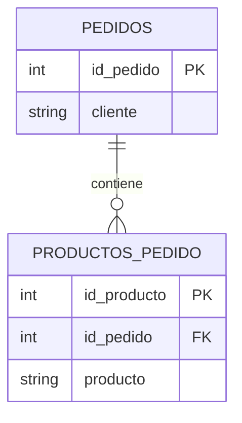
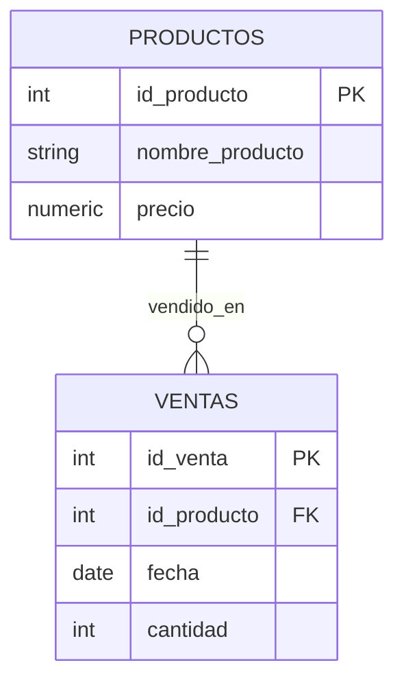
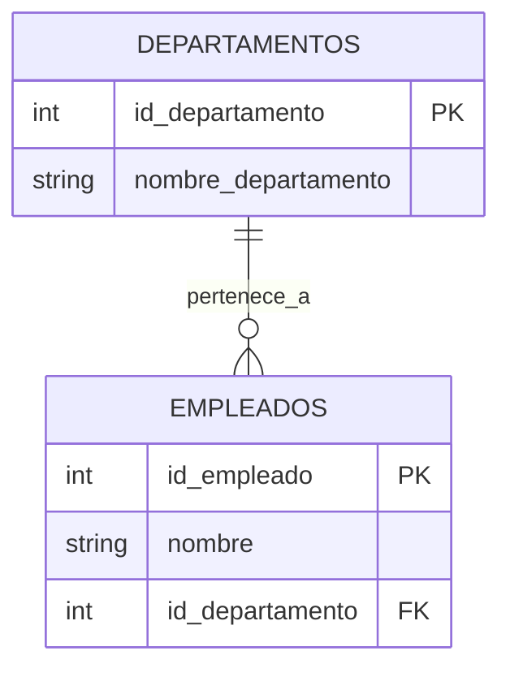

# 📘 Normalización de Bases de Datos

## ¿Qué es la normalización de base de datos?

La **normalización** es un proceso sistemático que organiza los datos en una base de datos relacional para reducir la **redundancia** y mejorar la **integridad**. Se basa en dividir grandes tablas en otras más pequeñas y definir relaciones entre ellas.

En términos simples: es como ordenar una bodega para que todo esté en su lugar, sin duplicados y fácil de encontrar.

---

## ¿Cuál es el propósito de la normalización?

- **Evitar duplicidad de datos**.
- **Mejorar la consistencia** de la información.
- **Facilitar el mantenimiento** de la base de datos.
- **Optimizar el almacenamiento** y las consultas.

---

## ¿Cuál es el objetivo?

El objetivo principal es **garantizar que cada dato esté almacenado una sola vez**, en el lugar correcto, y que las relaciones entre datos sean claras y eficientes.

---

## ✅ Ventajas

- Reducción de redundancia.
- Mayor integridad de datos.
- Facilidad para actualizar y mantener.
- Mejora en el rendimiento de consultas complejas.

## ❌ Desventajas

- Mayor complejidad en el diseño.
- Más relaciones entre tablas (más JOINs).
- Puede afectar el rendimiento en consultas simples si no se optimiza bien.

---

## 🧩 Casos reales

1. **Sistema de nómina**: Evitar duplicar información de empleados en cada pago.
2. **E-commerce**: Separar productos, categorías y proveedores para mantener datos limpios.
3. **Hospitales**: Dividir pacientes, médicos y tratamientos para evitar errores en historiales clínicos.

---

## ¿Cuántas formas normales existen?

Existen **7 formas normales**, pero en la práctica se utilizan principalmente las primeras tres:

1. **Primera Forma Normal (1NF)**
2. **Segunda Forma Normal (2NF)**
3. **Tercera Forma Normal (3NF)**
4. Cuarta Forma Normal (4NF)
5. Quinta Forma Normal (5NF)
6. Forma Normal de Boyce-Codd (BCNF)
7. Sexta Forma Normal (6NF)

---

## 🔢 Explicación de 1NF, 2NF y 3NF con ejemplos en PostgreSQL


## 🧱 Primera Forma Normal (1NF)

### 🔍 Regla clara:

> Una tabla está en 1NF si **cada celda contiene un solo valor** (atómico), **no listas ni conjuntos**, y **cada fila es única**.

***

### ❌ Tabla que **no cumple** 1NF

| id\_pedido | cliente | productos             |
| ---------- | ------- | --------------------- |
| 1          | Ana     | manzana, plátano, uva |
| 2          | Luis    | pera, mango           |

```sql
SELECT productos FROM pedidos WHERE cliente = 'Ana';
```

Resultado:

| productos             |
| --------------------- |
| manzana, plátano, uva |

🔴 **Problema**: No puedes filtrar por producto fácilmente. La celda contiene una lista.

***

### ✅ Tabla que **sí cumple** 1NF

**Tabla `pedidos`:**

| id\_pedido | cliente |
| ---------- | ------- |
| 1          | Ana     |
| 2          | Luis    |

**Tabla `productos_pedido`:**

| id\_producto | id\_pedido | producto |
| ------------ | ---------- | -------- |
| 1            | 1          | manzana  |
| 2            | 1          | plátano  |
| 3            | 1          | uva      |
| 4            | 2          | pera     |
| 5            | 2          | mango    |

```sql
SELECT producto FROM productos_pedido WHERE id_pedido = 1;
```

Resultado:

| producto |
| -------- |
| manzana  |
| plátano  |
| uva      |

***

### 📊 Diagrama ER (1NF)



***

### 🧪 Ejemplo práctico

> Ana hace un pedido con 3 productos. En lugar de guardar todos en una sola celda, se registran como 3 filas en otra tabla. Esto permite buscar, filtrar y analizar cada producto por separado.

***

## 🧱 Segunda Forma Normal (2NF)

### 🔍 Regla clara:

> Una tabla está en 2NF si **está en 1NF** y **todos los atributos no clave dependen completamente de la clave primaria**. Si la clave es compuesta, ningún atributo debe depender solo de una parte.

***

### ❌ Tabla que **no cumple** 2NF

| id\_producto | fecha      | nombre\_producto | precio | cantidad |
| ------------ | ---------- | ---------------- | ------ | -------- |
| 1            | 2025-09-01 | Manzana          | 10     | 5        |
| 1            | 2025-09-02 | Manzana          | 10     | 3        |

```sql
SELECT nombre_producto FROM ventas WHERE fecha = '2025-09-01';
```

Resultado:

| nombre\_producto |
| ---------------- |
| Manzana          |

🔴 **Problema**: `nombre_producto` y `precio` dependen solo de `id_producto`, no de la combinación `id_producto + fecha`.

***

### ✅ Tabla que **sí cumple** 2NF

**Tabla `productos`:**

| id\_producto | nombre\_producto | precio |
| ------------ | ---------------- | ------ |
| 1            | Manzana          | 10     |

**Tabla `ventas`:**

| id\_venta | id\_producto | fecha      | cantidad |
| --------- | ------------ | ---------- | -------- |
| 1         | 1            | 2025-09-01 | 5        |
| 2         | 1            | 2025-09-02 | 3        |

```sql
SELECT p.nombre_producto, v.cantidad
FROM ventas v
JOIN productos p ON v.id_producto = p.id_producto
WHERE v.fecha = '2025-09-01';
```

Resultado:

| nombre\_producto | cantidad |
| ---------------- | -------- |
| Manzana          | 5        |

***

### 📊 Diagrama ER (2NF)



***

### 🧪 Ejemplo práctico

> El producto "Manzana" tiene un precio fijo. Si se repite en varias ventas, no se debe duplicar su nombre y precio. Se guarda una sola vez en la tabla `productos`.

***

## 🧱 Tercera Forma Normal (3NF)

### 🔍 Regla clara:

> Una tabla está en 3NF si **está en 2NF** y **no hay dependencias transitivas**. Es decir, un atributo no clave no debe depender de otro atributo no clave.

***

### ❌ Tabla que **no cumple** 3NF

| id\_empleado | nombre | id\_departamento | nombre\_departamento |
| ------------ | ------ | ---------------- | -------------------- |
| 1            | Ana    | 10               | Finanzas             |
| 2            | Luis   | 20               | Ventas               |

```sql
SELECT nombre_departamento FROM empleados WHERE nombre = 'Ana';
```

Resultado:

| nombre\_departamento |
| -------------------- |
| Finanzas             |

🔴 **Problema**: `nombre_departamento` depende de `id_departamento`, que depende de `id_empleado`. Es una **dependencia transitiva**.

***

### ✅ Tabla que **sí cumple** 3NF

**Tabla `empleados`:**

| id\_empleado | nombre | id\_departamento |
| ------------ | ------ | ---------------- |
| 1            | Ana    | 10               |
| 2            | Luis   | 20               |

**Tabla `departamentos`:**

| id\_departamento | nombre\_departamento |
| ---------------- | -------------------- |
| 10               | Finanzas             |
| 20               | Ventas               |

```sql
SELECT d.nombre_departamento
FROM empleados e
JOIN departamentos d ON e.id_departamento = d.id_departamento
WHERE e.nombre = 'Ana';
```

Resultado:

| nombre\_departamento |
| -------------------- |
| Finanzas             |

***

### 📊 Diagrama ER (3NF)



***

### 🧪 Ejemplo práctico

> Si el nombre del departamento cambia, solo se actualiza en una tabla. Los empleados siguen vinculados por `id_departamento`, evitando errores y duplicación.


## 🧾 Conclusión

La normalización es una herramienta poderosa para diseñar bases de datos limpias, eficientes y seguras. Aunque puede parecer compleja al principio, sus beneficios a largo plazo en mantenimiento, escalabilidad y rendimiento son indiscutibles.

> En PostgreSQL, aplicar estas formas normales es sencillo gracias a su robusto sistema de relaciones y claves foráneas.


```
https://ebac.mx/blog/normalizacion-de-bases-de-datos
https://www.freecodecamp.org/espanol/news/normalizacion-de-base-de-datos-formas-normales-1nf-2nf-3nf-ejemplos-de-tablas/
https://www.datacamp.com/es/tutorial/normalization-in-sql
```
