# Secure TCP/IP Connections with SSL/TLS 

### ¿Qué es TLS (Transport Layer Security)? !🔒
 Versión mejorada de SSL Es un protocolo criptográfico de seguridad que proporciona **privacidad** y **integridad** en las comunicaciones entre aplicaciones y usuarios en Internet. TLS asegura que los datos transmitidos entre un cliente (como un navegador web) y un servidor no puedan ser interceptados o alterados por terceros. **TLS** utiliza **certificados X.509** para autenticar la identidad del servidor (y opcionalmente del cliente) antes de establecer una conexión segura.
- Los **certificados** son una parte esencial del proceso de **autenticación** en el protocolo **TLS**.  [las versiones permitidas son 1.2 y 1.3](https://documentation.meraki.com/General_Administration/Privacy_and_Security/TLS_Protocol_and_Compliance_Standards).

**⚠️ Advertencias**
  - **Vulnerabilidades de TLS 1.0 y 1.1**: Las versiones antiguas de TLS (1.0 y 1.1) tienen múltiples vulnerabilidades conocidas y no deben utilizarse.  [Windows deshabilita 1.0 y 1.1 ](https://learn.microsoft.com/es-es/lifecycle/announcements/transport-layer-security-1x-disablement)

 
## Características y Propósitos Principales de TLS

- **Confidencialidad** 🔐: TLS cifra los datos transmitidos para que solo el destinatario previsto pueda leerlos. Esto protege la información sensible, como contraseñas, datos personales y transacciones financieras, de ser interceptada por terceros.
- **Integridad de los Datos** 🛡️: TLS asegura que los datos no sean alterados durante la transmisión. Utiliza funciones hash criptográficas para verificar que los datos recibidos son los mismos que los enviados, sin modificaciones.
- **Autenticación** ✅: TLS verifica la identidad de las partes que se comunican. Utiliza certificados digitales emitidos por autoridades de certificación (CA) confiables para autenticar la identidad del servidor (y a veces del cliente), evitando ataques de suplantación de identidad.

### ¿Qué es SSL (Secure Sockets Layer) ? 🔒
Es un protocolo criptográfico desarrollado para proporcionar comunicaciones seguras entre un cliente y un servidor. Fue pionero en la seguridad de las comunicaciones en línea. Con el tiempo, SSL evolucionó a TLS, mejorando significativamente tanto la seguridad como la eficiencia. Debido a las vulnerabilidades conocidas en SSL, ya no se recomienda su uso."

**⚠️ Advertencias**
  - **Vulnerabilidades de SSL**: Las versiones antiguas de SSL (1.0, 2.0 y 3.0) tienen múltiples vulnerabilidades conocidas y no deben utilizarse. [vulnerabilidades de SSL](https://nicolascoolman.eu/es/2024/10/17/openssl-securite-2/)

### Motivo de migación de ssl a tls 
El cambio de SSL a TLS fue una evolución necesaria para abordar fallas de seguridad, establecer un protocolo estandarizado bajo el IETF y alinearse con las prácticas criptográficas modernas. TLS continúa evolucionando, lo que garantiza una protección sólida para las comunicaciones por Internet, mientras que SSL sigue obsoleto debido a sus riesgos inherentes.
TLS: Rendimiento y compatibilidad, Mejoras continuas, Estandarización por parte de la IETF

 
## Ejemplo de TLS en la vida real

**Escenario: Envío de Cartas**

Imagina que tienes que enviar una carta importante a tu amigo que vive en otra ciudad. Esta carta contiene información personal y confidencial.

**📬 Sin TLS (sin cifrado):**

En este caso, decides enviar la carta en un sobre transparente. Cualquiera que maneje la carta, desde el cartero hasta cualquier persona que la vea en el camino, puede leer su contenido. Aunque la carta puede llegar a su destino, existe un alto riesgo de que alguien más lea la información confidencial antes de que llegue a tu amigo.

**🔒 Con TLS (con cifrado):**

Ahora, decides enviar la carta en un sobre opaco y sellado. Solo tu amigo, que tiene la llave para abrir el sobre, puede leer el contenido de la carta. Durante el trayecto, nadie más puede ver lo que hay dentro del sobre, asegurando que la información permanezca privada y segura hasta que llegue a su destino.

 
 
## Aplicaciones Comunes de TLS
- **Bases de Datos** 🗄️: Protege las conexiones a bases de datos como PostgreSQL, garantizando que los datos transmitidos entre el cliente y el servidor estén cifrados y autenticados.
- **Autenticación** 🔑: TLS se utiliza en sistemas de autenticación para verificar la identidad de los usuarios y asegurar que las credenciales no sean interceptadas durante la transmisión.
- **Navegadores Web** 🌐: Protege las conexiones HTTPS, asegurando que la comunicación entre el navegador y el servidor web sea segura.
- **Correo Electrónico** 📧: Asegura la transmisión de correos electrónicos entre servidores.
- **Mensajería Instantánea** 💬: Protege los mensajes enviados a través de aplicaciones de chat.
- **VPNs (Redes Privadas Virtuales)** 🔒: Asegura las conexiones entre dispositivos y redes privadas.

## Beneficios de Usar TLS y Por Qué Deberíamos Utilizarlo

- **Seguridad Mejorada**: Protege contra ataques como la interceptación de datos  y la manipulación conocida como (MITM).
- **Confianza del Usuario**: Los usuarios confían más en sitios web o servicios que utilizan TLS.
- **Cumplimiento Normativo**: TLS ayuda a cumplir normativas de seguridad  y estándares aplicables, como : 
    1. **PCI DSS**: El Consejo de Normas de Seguridad de la Industria de Tarjetas de Pago (PCI SSC) proporciona información sobre los requisitos de seguridad para proteger los datos de las cuentas de pago. Puedes visitar su sitio oficial [aquí](https://www.pcisecuritystandards.org/faq/articles/Frequently_Asked_Question/does-pci-dss-define-which-versions-of-tls-must-be-used/).
    
    2. **HIPAA**: El Departamento de Salud y Servicios Humanos de los Estados Unidos (HHS) ofrece información sobre la Ley de Portabilidad y Responsabilidad de Seguros de Salud (HIPAA), incluyendo las reglas de seguridad y privacidad. Puedes acceder a su sitio oficial [aquí](https://www.hhs.gov/hipaa/for-professionals/breach-notification/guidance/index.html).
    
    3. **NIST**: El Instituto Nacional de Estándares y Tecnología (NIST) desarrolla y mantiene estándares, incluyendo los relacionados con la ciberseguridad y el uso de TLS. Puedes visitar su sitio oficial [aquí](https://csrc.nist.gov/pubs/sp/800/52/r2/final).

    4. **GDPR**: El Reglamento General de Protección de Datos (GDPR, por sus siglas en inglés) es una ley de la Unión Europea que entró en vigor el 25 de mayo de 2018. Su objetivo principal es proteger los datos personales de los ciudadanos de la UE y garantizar su privacidad. El GDPR establece normas estrictas sobre cómo las organizaciones deben manejar y proteger los datos personales, y otorga a los individuos varios derechos sobre sus datos, como el derecho al acceso, rectificación, supresión y portabilidad  [Reglamento general de protección de datos (GDPR)](https://eur-lex.europa.eu/ES/legal-content/summary/general-data-protection-regulation-gdpr.html).

 
## Resumen Rápido del Funcionamiento de TLS

1. **Negociación de la Conexión** 🔄: El cliente y el servidor inician la conexión acordando los parámetros de seguridad, como la versión de TLS y los algoritmos de cifrado a utilizar.
2. **Intercambio de Claves** 🔑: Se realiza un intercambio de claves criptográficas mediante un protocolo seguro, como el intercambio de claves Diffie-Hellman, para establecer una conexión segura.
3. **Cifrado de Datos** 🔒: Una vez establecida la conexión segura, los datos se cifran y se transmiten de manera segura entre el cliente y el servidor, protegiendo la información contra interceptaciones y manipulaciones.

**Diagrama en PlantUML**

```plantuml
@startuml
title Proceso Básico de TLS

actor Cliente
actor Servidor

Cliente -> Servidor: Solicitud de Conexión (ClientHello)
Servidor -> Cliente: Respuesta de Conexión (ServerHello)
Servidor -> Cliente: Certificado del Servidor
Servidor -> Cliente: Solicitud de Clave Pública
Cliente -> Servidor: Clave Pública del Cliente
Cliente -> Cliente: Genera Clave Simétrica
Cliente -> Servidor: Clave Simétrica Cifrada
Servidor -> Servidor: Desencripta Clave Simétrica
Cliente -> Servidor: Mensaje Cifrado
Servidor -> Cliente: Mensaje Cifrado

note right of Cliente
  1. Negociación de la Conexión
  2. Intercambio de Claves
  3. Cifrado de Datos
end note

@enduml
```

## Desventajas de Implementar TLS

- **⚙️ Complejidad de Configuración**: Configurar TLS correctamente puede ser complicado y requiere conocimientos técnicos avanzados. Esto incluye la generación y gestión de certificados, la configuración de los parámetros de seguridad y la actualización regular de estos certificados.
- **📉 Rendimiento**: El cifrado y descifrado de datos puede introducir una sobrecarga en el rendimiento del sistema. Esto puede ser especialmente notable en sistemas con alta carga de trabajo o en aquellos que manejan grandes volúmenes de datos.
- **🔧 Mantenimiento Adicional**: TLS requiere un mantenimiento continuo, como la renovación de certificados y la actualización de las versiones de TLS para asegurar que se utilizan las versiones más seguras y actualizadas.
- **🔄 Administración de Certificados**: La rotación automática de certificados, el monitoreo constante y la validación por personal especializado son necesarios para mantener la seguridad. Esto puede requerir recursos adicionales y personal capacitado.
- **🔗 Compatibilidad**: No todos los clientes o aplicaciones pueden ser compatibles con las versiones más recientes de TLS. Esto puede requerir actualizaciones o modificaciones adicionales en el software cliente.
- **💰 Costos**: Aunque TLS en sí mismo es gratuito, los certificados SSL/TLS emitidos por autoridades de certificación (CA) pueden tener un costo que varía dependiendo del tipo de certificado. Además, el tiempo y los recursos necesarios para implementar y mantener TLS también pueden representar un costo significativo.

 

