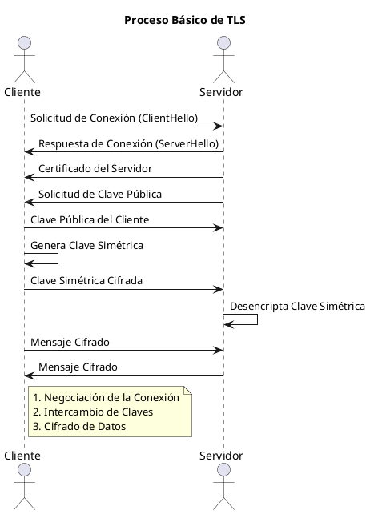

# Secure TCP/IP Connections with SSL/TLS 

### ¿Qué es TLS (Transport Layer Security)? !🔒
Es un protocolo criptográfico diseñado para proporcionar comunicaciones seguras a través de una red.   [las versiones permitidas son 1.2 y 1.3](https://documentation.meraki.com/General_Administration/Privacy_and_Security/TLS_Protocol_and_Compliance_Standards).

**⚠️ Advertencias**
  - **Vulnerabilidades de TLS 1.0 y 1.1**: Las versiones antiguas de TLS (1.0 y 1.1) tienen múltiples vulnerabilidades conocidas y no deben utilizarse.  [Windows deshabilita 1.0 y 1.1 ](https://learn.microsoft.com/es-es/lifecycle/announcements/transport-layer-security-1x-disablement)

### ¿Qué es SSL (Secure Sockets Layer) ? 🔒
Es un protocolo criptográfico desarrollado para proporcionar comunicaciones seguras entre un cliente y un servidor. Fue pionero en la seguridad de las comunicaciones en línea. Con el tiempo, SSL evolucionó a TLS, mejorando significativamente tanto la seguridad como la eficiencia. Debido a las vulnerabilidades conocidas en SSL, ya no se recomienda su uso."

**⚠️ Advertencias**
  - **Vulnerabilidades de SSL**: Las versiones antiguas de SSL (1.0, 2.0 y 3.0) tienen múltiples vulnerabilidades conocidas y no deben utilizarse. [vulnerabilidades de SSL](https://nicolascoolman.eu/es/2024/10/17/openssl-securite-2/)

 
## Ejemplo de TLS en la vida real

**Escenario: Envío de Cartas**

Imagina que tienes que enviar una carta importante a tu amigo que vive en otra ciudad. Esta carta contiene información personal y confidencial.

**📬 Sin TLS (sin cifrado):**

En este caso, decides enviar la carta en un sobre transparente. Cualquiera que maneje la carta, desde el cartero hasta cualquier persona que la vea en el camino, puede leer su contenido. Aunque la carta puede llegar a su destino, existe un alto riesgo de que alguien más lea la información confidencial antes de que llegue a tu amigo.

**🔒 Con TLS (con cifrado):**

Ahora, decides enviar la carta en un sobre opaco y sellado. Solo tu amigo, que tiene la llave para abrir el sobre, puede leer el contenido de la carta. Durante el trayecto, nadie más puede ver lo que hay dentro del sobre, asegurando que la información permanezca privada y segura hasta que llegue a su destino.

## Propósitos Principales de TLS

### 1. **Confidencialidad** 🔐

TLS cifra los datos transmitidos para que solo el destinatario previsto pueda leerlos. Esto protege la información sensible, como contraseñas, datos personales y transacciones financieras, de ser interceptada por terceros.

### 2. **Integridad de los Datos** 🛡️

TLS asegura que los datos no sean alterados durante la transmisión. Utiliza funciones hash criptográficas para verificar que los datos recibidos son los mismos que los enviados, sin modificaciones.

### 3. **Autenticación** ✅

TLS verifica la identidad de las partes que se comunican. Utiliza certificados digitales para asegurar que el servidor (y a veces el cliente) es quien dice ser, evitando ataques de suplantación de identidad.

 
## Aplicaciones Comunes de TLS
- **Bases de Datos** 🗄️: Protege las conexiones a bases de datos como PostgreSQL, garantizando que los datos transmitidos entre el cliente y el servidor estén cifrados y autenticados.
- **Autenticación** 🔑: TLS se utiliza en sistemas de autenticación para verificar la identidad de los usuarios y asegurar que las credenciales no sean interceptadas durante la transmisión.
- **Navegadores Web** 🌐: Protege las conexiones HTTPS, asegurando que la comunicación entre el navegador y el servidor web sea segura.
- **Correo Electrónico** 📧: Asegura la transmisión de correos electrónicos entre servidores.
- **Mensajería Instantánea** 💬: Protege los mensajes enviados a través de aplicaciones de chat.
- **VPNs (Redes Privadas Virtuales)** 🔒: Asegura las conexiones entre dispositivos y redes privadas.

## Beneficios de Usar TLS y Por Qué Deberíamos Utilizarlo

- **Seguridad Mejorada**: Protege contra ataques como la interceptación de datos  y la manipulación conocida como (MITM).
- **Confianza del Usuario**: Los usuarios confían más en sitios web o servicios que utilizan TLS.
- **Cumplimiento Normativo**: TLS ayuda a cumplir normativas de seguridad  y estándares aplicables, como : 
    1. **PCI DSS**: El Consejo de Normas de Seguridad de la Industria de Tarjetas de Pago (PCI SSC) proporciona información sobre los requisitos de seguridad para proteger los datos de las cuentas de pago. Puedes visitar su sitio oficial [aquí](https://www.pcisecuritystandards.org/faq/articles/Frequently_Asked_Question/does-pci-dss-define-which-versions-of-tls-must-be-used/).
    
    2. **HIPAA**: El Departamento de Salud y Servicios Humanos de los Estados Unidos (HHS) ofrece información sobre la Ley de Portabilidad y Responsabilidad de Seguros de Salud (HIPAA), incluyendo las reglas de seguridad y privacidad. Puedes acceder a su sitio oficial [aquí](https://www.hhs.gov/hipaa/for-professionals/breach-notification/guidance/index.html).
    
    3. **NIST**: El Instituto Nacional de Estándares y Tecnología (NIST) desarrolla y mantiene estándares, incluyendo los relacionados con la ciberseguridad y el uso de TLS. Puedes visitar su sitio oficial [aquí](https://csrc.nist.gov/pubs/sp/800/52/r2/final).

 

## Resumen Rápido del Funcionamiento de TLS

1. **Negociación de la Conexión** 🔄: El cliente y el servidor inician la conexión acordando los parámetros de seguridad, como la versión de TLS y los algoritmos de cifrado a utilizar.
2. **Intercambio de Claves** 🔑: Se realiza un intercambio de claves criptográficas mediante un protocolo seguro, como el intercambio de claves Diffie-Hellman, para establecer una conexión segura.
3. **Cifrado de Datos** 🔒: Una vez establecida la conexión segura, los datos se cifran y se transmiten de manera segura entre el cliente y el servidor, protegiendo la información contra interceptaciones y manipulaciones.

**Diagrama en PlantUML**

 
 

 
# Referencias extras.

  - **Documentation**  https://www.postgresql.org/docs/
  - **Transport Layer** Security (TLS) Parameters https://www.iana.org/assignments/tls-parameters/tls-parameters.xhtml
  - **Qué es TLS** https://www.cloudflare.com/es-es/learning/ssl/transport-layer-security-tls/

