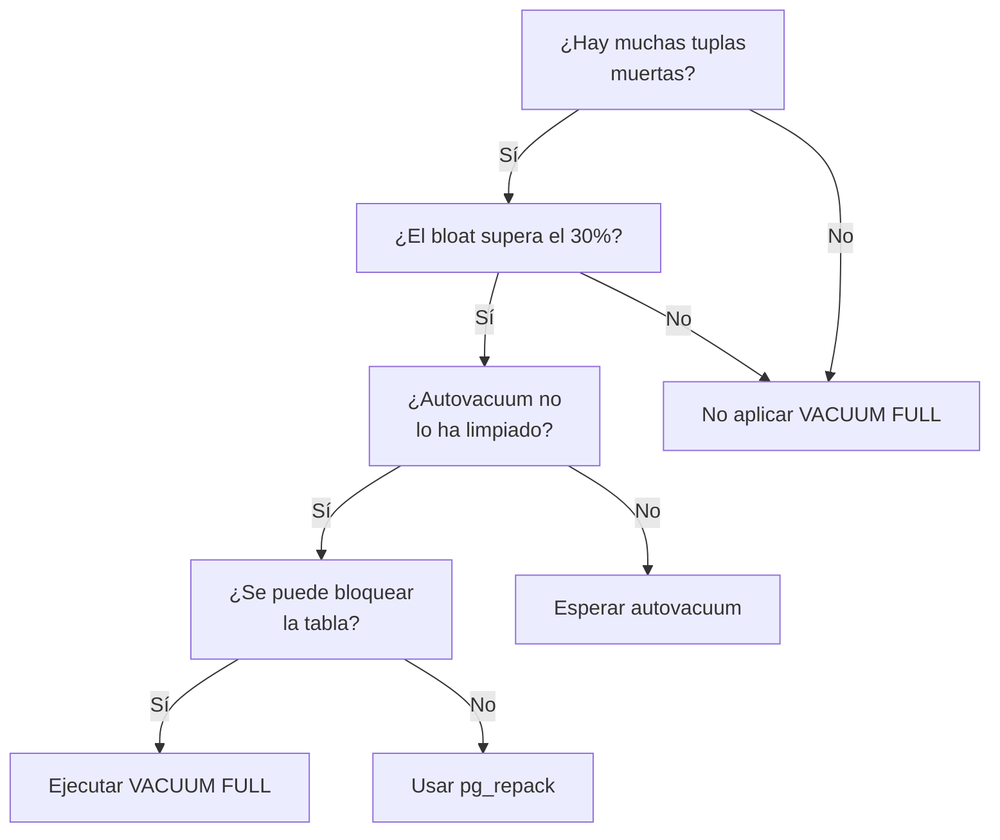

 

## 🧠 Análisis estructurado: ¿Cuándo aplicar `VACUUM FULL` en PostgreSQL?

***

### 🎯 Objetivo

Determinar cuándo es apropiado ejecutar un `VACUUM FULL` en una tabla de PostgreSQL, basándose en indicadores como:

*   Cantidad de tuplas muertas
*   Porcentaje de bloat
*   Visibilidad de páginas
*   Ineficiencia del autovacuum

***

### ✅ Ventajas de `VACUUM FULL`

| Ventaja                 | Descripción                                 |
| ----------------------- | ------------------------------------------- |
| Recupera espacio físico | Reduce el tamaño del archivo en disco       |
| Elimina bloat           | Reescribe la tabla eliminando fragmentación |
| Mejora el rendimiento   | Optimiza acceso a datos y uso de índices    |

***

### ❌ Desventajas

| Desventaja                | Descripción                                        |
| ------------------------- | -------------------------------------------------- |
| Bloquea la tabla          | Es una operación exclusiva (lock de escritura)     |
| Costoso en tiempo         | Puede tardar mucho en tablas grandes               |
| Requiere espacio temporal | Duplica el tamaño de la tabla durante la operación |

***

### 🧪 Casos de uso reales

*   Tablas con alto volumen de escrituras y borrados
*   Tablas que no han sido vaciadas correctamente por autovacuum
*   Tablas con bloat superior al 30%
*   Tablas con muchas tuplas muertas y bajo porcentaje de páginas visibles

***

### 📅 ¿Cuándo usarlo?

*   Cuando el bloat supera el 20–30% y afecta el rendimiento
*   Cuando `pg_visibility` muestra muchas páginas parcialmente visibles
*   Cuando `pg_stat_user_tables` indica muchas tuplas muertas y bajo `n_dead_tup`
*   Cuando `pgstattuple` muestra alto porcentaje de espacio no utilizado

***

### 🚫 ¿Cuándo no usarlo?

*   En tablas que están siendo accedidas constantemente (por el lock)
*   Si el autovacuum está funcionando correctamente
*   Si el espacio libre no está afectando el rendimiento
*   Si el bloat es menor al 10–15%

***

### 🧩 Competencias o tecnologías alternativas

| Alternativa         | Descripción                                           |
| ------------------- | ----------------------------------------------------- |
| `VACUUM` normal     | Limpia tuplas muertas sin bloquear                    |
| `pg_repack`         | Reorganiza tablas sin lock exclusivo                  |
| `CLUSTER`           | Reordena físicamente la tabla según un índice         |
| `autovacuum tuning` | Ajuste de parámetros para mejorar limpieza automática |

***

### ⚠️ Consideraciones antes y después

#### Antes:

*   Verificar tamaño de la tabla
*   Evaluar impacto de bloqueo
*   Confirmar que el bloat es significativo

#### Después:

*   Reindexar si es necesario
*   Monitorear rendimiento
*   Ajustar parámetros de autovacuum si el problema es recurrente

***

### 📝 Notas importantes

*   `VACUUM FULL` no es una solución frecuente, sino una medida correctiva
*   En entornos productivos, se recomienda usarlo en ventanas de mantenimiento
*   Puede ser más eficiente usar `pg_repack` si no se puede bloquear la tabla

***

### 🌐 Opinión de la comunidad

*   DBA experimentados lo consideran una herramienta poderosa pero peligrosa si se usa sin análisis previo
*   En entornos OLTP, se prefiere evitarlo salvo en casos extremos
*   En entornos analíticos, puede ser parte de rutinas mensuales

***

### 📊 Ejemplo real

Supongamos que ejecutas:

```sql
SELECT n_dead_tup, n_live_tup FROM pg_stat_user_tables WHERE relname = 'ventas';
```

Y obtienes:

| n\_dead\_tup | n\_live\_tup |
| ------------ | ------------ |
| 150000       | 200000       |

Esto indica que el **43%** de las tuplas están muertas. Si además `pg_visibility_map_summary('ventas')` muestra que solo el 50% de las páginas están completamente visibles, es un fuerte candidato para `VACUUM FULL`.


