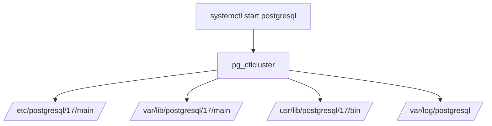

### ❓ 4. ¿Qué es `systemctl` en PostgreSQL?

`systemctl` es el comando que gestiona servicios en sistemas basados en `systemd`. Cuando se usa para iniciar PostgreSQL, este ejecuta el servicio definido en el archivo:

```bash
vim /lib/systemd/system/postgresql.service
systemctl edit postgresql.service
```

Este archivo apunta a un **cluster** gestionado por `pg_ctlcluster`.

***

### ⚖️ 5. Ventajas y Desventajas

**Ventajas:**

*   Integración con el sistema operativo
*   Autoinicio al arrancar el sistema
*   Gestión centralizada de logs y estado

**Desventajas:**

*   Menos flexible para rutas personalizadas
*   Depende de `pg_ctlcluster`, no de `pg_ctl` directamente

***

### 🏢 6. Simulación empresarial

> **Empresa:** FinanSecure S.A.\
> **Servidor:** Ubuntu 22.04\
> **PostgreSQL:** Instalado vía `apt`\
> **Inicio:** `sudo systemctl start postgresql`\
> **Pregunta:** ¿Dónde están los binarios y los datos?

***

### 🧠 7. Estructura Semántica

```plaintext
/usr/lib/postgresql/17/bin/         → binarios del motor
/var/lib/postgresql/17/main/        → datos del cluster
/etc/postgresql/17/main/            → configuración del cluster
/var/log/postgresql/                → logs del servicio
/usr/share/postgresql/17/           → Ejemplos

```

***

### 📊 8. Visualización técnica




***

### 🛠️ 9. Procedimiento paso a paso

#### 🔹 Paso 1: Verificar estado del servicio

```bash
sudo systemctl status postgresql
```

📎 **Simulación de salida:**

```plaintext
● postgresql.service - PostgreSQL RDBMS
     Loaded: loaded (/lib/systemd/system/postgresql.service; enabled)
     Active: active (exited)
```

#### 🔹 Paso 2: Verificar clusters activos

```bash
pg_lsclusters
```

📎 **Simulación de salida:**

```plaintext
Ver Cluster  Port Status Owner    Data directory              Log file
17  main     5432 online postgres /var/lib/postgresql/17/main /var/log/postgresql/postgresql-17-main.log
```


> [!IMPORTANT]
> Una vez que integras postgresql con systemctl no se debe de usar el pg_ctl u otra herramienta para restart,start,stop y reload ya que desincroniza el estatus del systemctl 


### 1. **systemctl**

**Ventajas:**

1. **Gestión de Dependencias**: systemctl maneja dependencias entre servicios, asegurando que PostgreSQL se inicie solo después de que otros servicios necesarios estén disponibles.
2. **Facilidad de Uso**: Comandos simples para habilitar, iniciar, detener y verificar el estado del servicio.
3. **Estándar Moderno**: systemctl es el estándar para la mayoría de las distribuciones modernas de Linux.
4. **Gestión de Logs**: Integración con journald para la gestión centralizada de logs.
5. **Control Granular**: Permite configurar cómo se inicia, detiene y reinicia el servicio.

**Desventajas:**

1. **Curva de Aprendizaje**: Puede requerir algo de aprendizaje para aquellos no familiarizados con systemd.
2. **Compatibilidad**: No disponible en sistemas muy antiguos que no usan systemd.

**Comandos:**
sudo systemctl enable postgresql
sudo systemctl start postgresql
sudo systemctl status postgresql
### 2. **crontab con @reboot**

**Ventajas:**

1. **Simplicidad**: Muy fácil de configurar y entender.
2. **Portabilidad**: Funciona en casi cualquier sistema Unix-like con cron.

**Desventajas:**

1. **Sin Gestión de Dependencias**: No maneja dependencias entre servicios.
2. **No Estándar**: No es la práctica estándar para manejar servicios de base de datos.
3. **Logs**: La gestión de logs y errores requiere configuración adicional.

**Configuración:** 
crontab -e

** Agregar la línea siguiente **
@reboot pg_ctl start -D /ruta/data


### 3. **/etc/rc.local**
**Ventajas:**

1. **Compatibilidad**: Funciona en sistemas Unix y Linux antiguos.
2. **Simplicidad**: Fácil de configurar, especialmente en sistemas más antiguos.

**Desventajas:**

1. **Obsoleto**: Considerado obsoleto en la mayoría de las distribuciones modernas.
2. **Sin Gestión de Dependencias**: No maneja dependencias entre servicios.
3. **Logs**: No proporciona una gestión de logs adecuada sin configuración adicional.

**Configuración:**
Edita el archivo /etc/rc.local y añade la línea antes de exit 0:
sudo systemctl start postgresql
### Conclusión

**systemctl** es la mejor opción para la mayoría de los sistemas modernos debido a su capacidad para manejar dependencias y su integración con las herramientas del sistema.
**crontab con @reboot** es una opción simple y rápida pero no adecuada para un entorno de producción serio.
**/etc/rc.local** puede ser útil en sistemas más antiguos, pero es mejor evitarlo en sistemas modernos debido a su obsolescencia.

Para un entorno de producción, es altamente recomendable usar systemctl para gestionar el servicio de PostgreSQL.

# Comandos 
 ```sql
vim /lib/systemd/system/postgresql.service

 sudo -l 
 
sudo /usr/bin/systemctl start postgresql-11.service  
sudo /usr/bin/systemctl stop postgresql-11.service 
sudo /usr/bin/systemctl restart postgresql-11.service
sudo /usr/bin/systemctl reload postgresql-11.service

sudo /usr/bin/systemctl enable postgresql-11.service
sudo /usr/bin/systemctl disable postgresql-11.service

sudo /usr/bin/systemctl status postgresql-11.service
 sudo /usr/bin/systemctl edit postgresql-11.service  --full
 
 ls -lhtra /lib/systemd/system/ | grep postg

 systemctl list-unit-files | grep post
 
 
  ```

# Ejemplo de configuración de postgresql.service
 ```sql
Description=PostgreSQL database server
After=network.target

[Service]
Type=idle
User=postgres
Group=postgres

PIDFile=/sysx/data16/postmaster.pid
ExecStart=/usr/local/pgsql/bin/pg_ctl start -o -i -D /sysx/data -w -t 120
RemainAfterExit=true

#---valida si los archivos de postgresql estan corruptos 
#/usr/pgsql-11/bin/postgresql-11-check-db-dir /sysx/data11

ExecReload=/usr/local/pgsql/bin/pg_ctl reload -s -D /sysx/data
RemainAfterExit=true

ExecStop=/usr/local/pgsql/bin/pg_ctl stop -m fast -s -D /sysx/data
RemainAfterExit=true

Restart=on-abnormal

# Due to PostgreSQL's use of shared memory, OOM killer is often overzealous in
# killing Postgres, so adjust it downward
OOMScoreAdjust=-200

[Install]
WantedBy=multi-user.target
 ```


# Ejemplo #2 de configuración de postgresql.service
 ```sql

[Unit]
Description=PostgreSQL database server
After=network.target

[Service]
Type=forking

User=postgres
Group=postgres

# Where to send early-startup messages from the server (before the logging
# options of postgresql.conf take effect)
# This is normally controlled by the global default set by systemd
# StandardOutput=syslog

# Disable OOM kill on the postmaster
OOMScoreAdjust=-1000
# ... but allow it still to be effective for child processes
# (note that these settings are ignored by Postgres releases before 9.5)
Environment=PG_OOM_ADJUST_FILE=/proc/self/oom_score_adj
Environment=PG_OOM_ADJUST_VALUE=0

# Maximum number of seconds pg_ctl will wait for postgres to start.  Note that
# PGSTARTTIMEOUT should be less than TimeoutSec value.
Environment=PGSTARTTIMEOUT=270

Environment=PGDATA=/usr/local/pgsql/data


ExecStart=/usr/local/pgsql/bin/pg_ctl start -D ${PGDATA} -s -w -t ${PGSTARTTIMEOUT}
ExecStop=/usr/local/pgsql/bin/pg_ctl stop -D ${PGDATA} -s -m fast
ExecReload=/usr/local/pgsql/bin/pg_ctl reload -D ${PGDATA} -s

# Give a reasonable amount of time for the server to start up/shut down.
# Ideally, the timeout for starting PostgreSQL server should be handled more
# nicely by pg_ctl in ExecStart, so keep its timeout smaller than this value.
TimeoutSec=300

[Install]
WantedBy=multi-user.target

 ```

1. **Bibliografías**:
    ```sql
    https://www.postgresql.org/docs/current/server-start.html
    https://unix.stackexchange.com/questions/220362/systemd-postgresql-start-script
    ```
